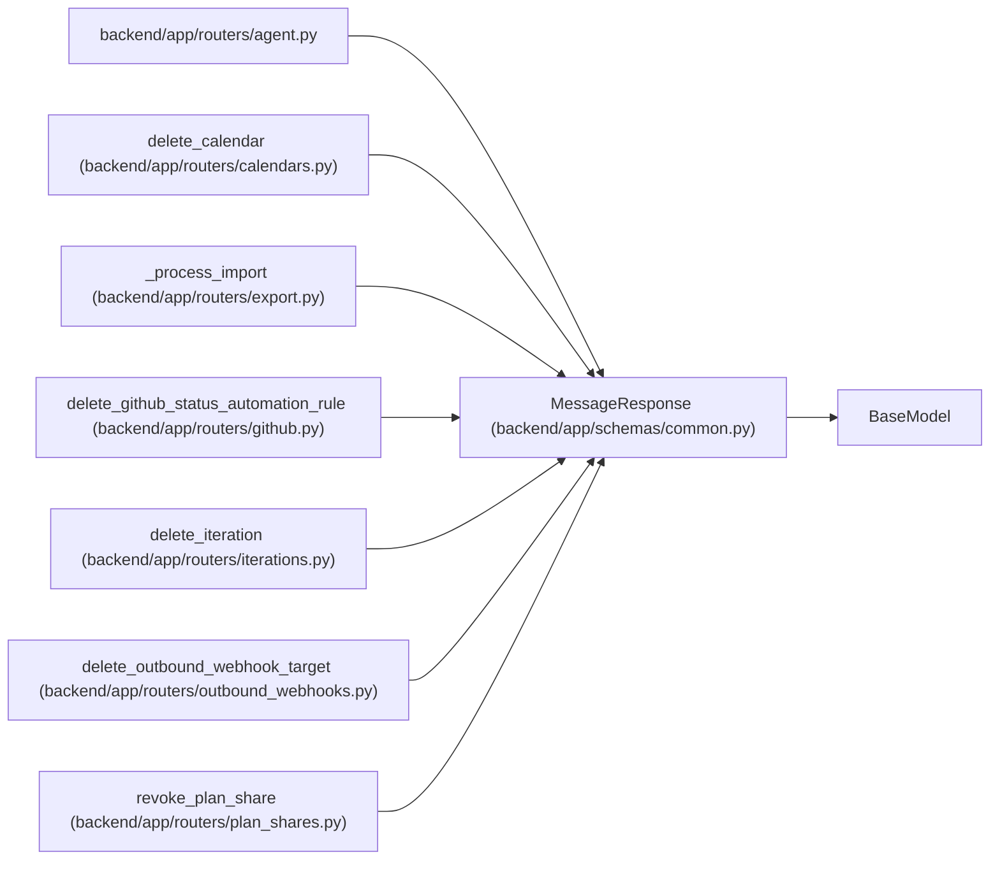

# MessageResponse

**Location:** `backend/app/schemas/common.py:18`
**Kind:** Pydantic model
**Bases:** `BaseModel`
**Module:** [schemas_common](../modules/schemas_common.md)

## Description

Simple message response.

## Attributes

| Name | Type | Wire name | Required | Nullable | Default | Constraints | Examples | Description |
|------|------|-----------|----------|----------|---------|-------------|-------------|----------|
| `message` | `str` | `message` | Yes | No | — | — | — | — |
| `success` | `bool` | `success` | No | No | `True` | — | — | — |

## Methods

*No public methods. Inherits from base classes.*

## Relationships

<!-- Auto-generated relationship summary. Do not edit by hand. -->

### Summary

| Module | Methods | Attributes |
|---|---:|---|
| [schemas_common](../modules/schemas_common.md) | 0 | `message`, `success` |

### Structure

| Kind | Entity | Module |
|---|---|---|
| Base | `BaseModel` | — |

### References

| Reference | Kind | Source | Call sites |
|---|---|---|---:|
| `agent` | import | [routers_agent](../modules/routers_agent.md) | — |
| `delete_calendar` | call | [calendars](../modules/calendars.md) | 1 |
| `delete_calendar` | type_reference | [calendars](../modules/calendars.md) | — |
| `_process_import` | call | [export](../modules/export.md) | 1 |
| `delete_github_status_automation_rule` | call | [routers_github](../modules/routers_github.md) | 1 |
| `delete_github_status_automation_rule` | type_reference | [routers_github](../modules/routers_github.md) | — |
| `delete_iteration` | call | [iterations](../modules/iterations.md) | 1 |
| `delete_iteration` | type_reference | [iterations](../modules/iterations.md) | — |
| `delete_outbound_webhook_target` | call | [outbound_webhooks](../modules/outbound_webhooks.md) | 1 |
| `delete_outbound_webhook_target` | type_reference | [outbound_webhooks](../modules/outbound_webhooks.md) | — |
| `revoke_plan_share` | call | [plan_shares](../modules/plan_shares.md) | 1 |
| `revoke_plan_share` | type_reference | [plan_shares](../modules/plan_shares.md) | — |

> References: showing 12 of 42 logical references; 30 omitted by the 12-row generated summary limit.
