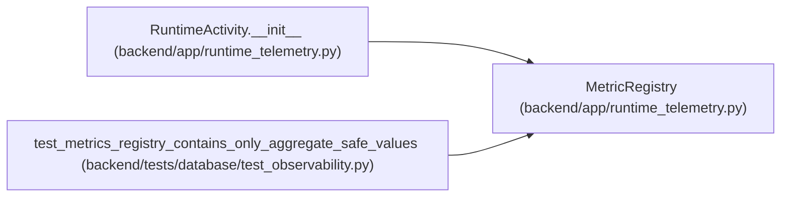

# MetricRegistry

**Location:** `backend/app/runtime_telemetry.py:36`
**Kind:** Class
**Bases:** —
**Module:** [runtime_telemetry](../modules/runtime_telemetry.md)

## Description

Process-local Prometheus-compatible aggregate registry.

## Attributes

*No annotated attributes found.*

## Methods

| Method | Signature | Decorators | Description |
|--------|-----------|------------|-------------|
| `__init__` | `() -> None` | — | — |
| `increment` | `(name: str, amount: float = 1.0, *, labels: Mapping[str, str] \| None = None) -> None` | — | — |
| `set_gauge` | `(name: str, value: float, *, labels: Mapping[str, str] \| None = None) -> None` | — | — |
| `add_gauge` | `(name: str, amount: float, *, labels: Mapping[str, str] \| None = None) -> float` | — | — |
| `observe` | `(name: str, value: float, *, labels: Mapping[str, str] \| None = None) -> None` | — | — |
| `gauge_value` | `(name: str, *, labels: Mapping[str, str] \| None = None) -> float` | — | — |
| `render_prometheus` | `() -> str` | — | Render a stable scrape without leaking high-cardinality values. |

## Relationships

<!-- Auto-generated relationship summary. Do not edit by hand. -->

### Summary

| Module | Methods | Attributes |
|---|---:|---|
| [runtime_telemetry](../modules/runtime_telemetry.md) | 7 | — |

### References

| Reference | Kind | Source | Call sites |
|---|---|---|---:|
| `RuntimeActivity.__init__` | type_reference | [runtime_telemetry](../modules/runtime_telemetry.md) | — |
| `test_metrics_registry_contains_only_aggregate_safe_values` | call | [test_observability](../modules/test_observability.md) | 1 |
