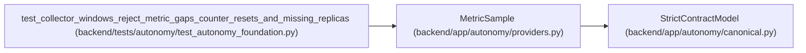

# MetricSample

**Location:** `backend/app/autonomy/providers.py:222`
**Kind:** Pydantic model
**Bases:** `StrictContractModel`
**Module:** [providers](../modules/providers.md)

## Description

_Auto-generated from `MetricSample` in `backend/app/autonomy/providers.py`._

## Validators

| Method | Scope | Fields | Mode | Options |
|--------|-------|--------|------|---------|
| `aware_sample` | field | sampled_at | after | — |

## Attributes

| Name | Type | Wire name | Required | Nullable | Default | Constraints | Examples | Description |
|------|------|-----------|----------|----------|---------|-------------|-------------|----------|
| `sampled_at` | `datetime` | `sampled_at` | Yes | No | — | — | — | — |
| `value` | `float` | `value` | Yes | No | — | — | — | — |
| `counter_generation` | `str` | `counter_generation` | Yes | No | — | max_length=255; min_length=1 | — | — |

## Methods

| Method | Signature | Decorators | Description |
|--------|-----------|------------|-------------|
| `aware_sample` | `(value: datetime) -> datetime` | `@field_validator('sampled_at')`, `@classmethod` | — |

## Relationships

<!-- Auto-generated relationship summary. Do not edit by hand. -->

### Summary

| Module | Methods | Attributes |
|---|---:|---|
| [providers](../modules/providers.md) | 1 | `counter_generation`, `sampled_at`, `value` |

### Structure

| Kind | Entity | Module |
|---|---|---|
| Base | `StrictContractModel` | [autonomy_canonical](../modules/autonomy_canonical.md) |

### References

| Reference | Kind | Source | Call sites |
|---|---|---|---:|
| `test_collector_windows_reject_metric_gaps_counter_resets_and_missing_replicas` | call | [test_autonomy_foundation](../modules/test_autonomy_foundation.md) | 3 |
