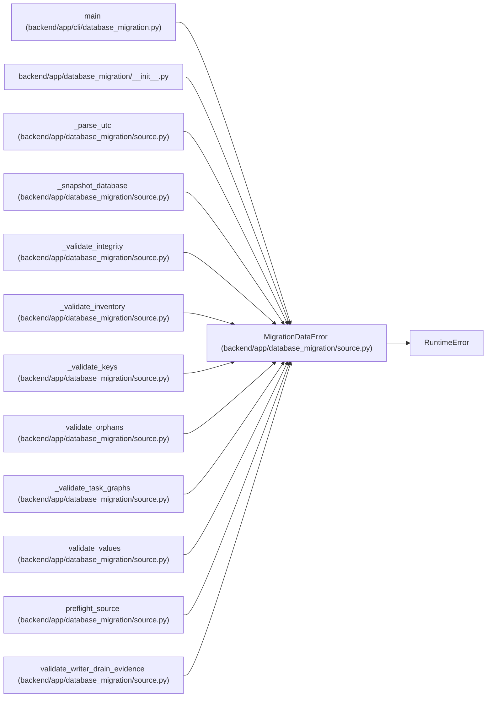

# MigrationDataError

**Location:** `backend/app/database_migration/source.py:49`
**Kind:** Class
**Bases:** `RuntimeError`
**Module:** [source](../modules/source.md)

## Description

A fail-closed source, transfer, or reconciliation condition.

## Attributes

*No annotated attributes found.*

## Methods

| Method | Signature | Decorators | Description |
|--------|-----------|------------|-------------|
| `__init__` | `(code: str, message: str)` | — | — |

## Relationships

<!-- Auto-generated relationship summary. Do not edit by hand. -->

### Summary

| Module | Methods | Attributes |
|---|---:|---|
| [source](../modules/source.md) | 1 | — |

### Structure

| Kind | Entity | Module |
|---|---|---|
| Base | `RuntimeError` | — |

### References

| Reference | Kind | Source | Call sites |
|---|---|---|---:|
| `main` | call | [cli_database_migration](../modules/cli_database_migration.md) | 1 |
| `__init__` | import | [database_migration___init__](../modules/database_migration___init__.md) | — |
| `_parse_utc` | call | [source](../modules/source.md) | 3 |
| `_snapshot_database` | call | [source](../modules/source.md) | 1 |
| `_validate_integrity` | call | [source](../modules/source.md) | 2 |
| `_validate_inventory` | call | [source](../modules/source.md) | 4 |
| `_validate_keys` | call | [source](../modules/source.md) | 3 |
| `_validate_orphans` | call | [source](../modules/source.md) | 1 |
| `_validate_task_graphs` | call | [source](../modules/source.md) | 2 |
| `_validate_values` | call | [source](../modules/source.md) | 6 |
| `preflight_source` | call | [source](../modules/source.md) | 12 |
| `validate_writer_drain_evidence` | call | [source](../modules/source.md) | 17 |

> References: showing 12 of 35 logical references; 23 omitted by the 12-row generated summary limit.
