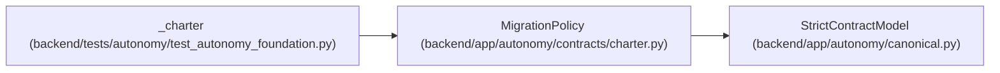

# MigrationPolicy

**Location:** `backend/app/autonomy/contracts/charter.py:105`
**Kind:** Pydantic model
**Bases:** `StrictContractModel`
**Module:** [charter](../modules/charter.md)

## Description

_Auto-generated from `MigrationPolicy` in `backend/app/autonomy/contracts/charter.py`._

## Validators

| Method | Scope | Fields | Mode | Options |
|--------|-------|--------|------|---------|
| `remediation_allowlist` | field | allowed_remediation_classes | after | — |

## Attributes

| Name | Type | Wire name | Required | Nullable | Default | Constraints | Examples | Description |
|------|------|-----------|----------|----------|---------|-------------|-------------|----------|
| `downtime_seconds` | `int` | `downtime_seconds` | Yes | No | — | ge=0; le=86400 | — | — |
| `rpo_seconds` | `int` | `rpo_seconds` | Yes | No | — | ge=0; le=86400 | — | — |
| `rto_seconds` | `int` | `rto_seconds` | Yes | No | — | ge=1; le=604800 | — | — |
| `snapshot_max_age_hours` | `int` | `snapshot_max_age_hours` | Yes | No | — | ge=1; le=24 | — | — |
| `retention_days` | `int` | `retention_days` | Yes | No | — | ge=1; le=3650 | — | — |
| `availability_observation_days` | `Literal[30]` | `availability_observation_days` | No | No | `30` | — | — | — |
| `availability_target_percent` | `float` | `availability_target_percent` | Yes | No | — | gt=0; le=100 | — | — |
| `allowed_remediation_classes` | `tuple[str, ...]` | `allowed_remediation_classes` | Yes | No | — | max_length=128 | — | — |
| `pre_write_recovery` | `Literal['sqlite-rollback']` | `pre_write_recovery` | No | No | `'sqlite-rollback'` | — | — | — |
| `post_write_recovery` | `Literal['postgresql-forward-only']` | `post_write_recovery` | No | No | `'postgresql-forward-only'` | — | — | — |

## Methods

| Method | Signature | Decorators | Description |
|--------|-----------|------------|-------------|
| `remediation_allowlist` | `(value: tuple[str, ...]) -> tuple[str, ...]` | `@field_validator('allowed_remediation_classes')`, `@classmethod` | — |

## Relationships

<!-- Auto-generated relationship summary. Do not edit by hand. -->

### Summary

| Module | Methods | Attributes |
|---|---:|---|
| [charter](../modules/charter.md) | 1 | `allowed_remediation_classes`, `availability_observation_days`, `availability_target_percent`, `downtime_seconds`, `post_write_recovery`, `pre_write_recovery`, `retention_days`, `rpo_seconds`, `rto_seconds`, `snapshot_max_age_hours` |

### Structure

| Kind | Entity | Module |
|---|---|---|
| Base | `StrictContractModel` | [autonomy_canonical](../modules/autonomy_canonical.md) |

### References

| Reference | Kind | Source | Call sites |
|---|---|---|---:|
| `_charter` | call | [test_autonomy_foundation](../modules/test_autonomy_foundation.md) | 1 |
