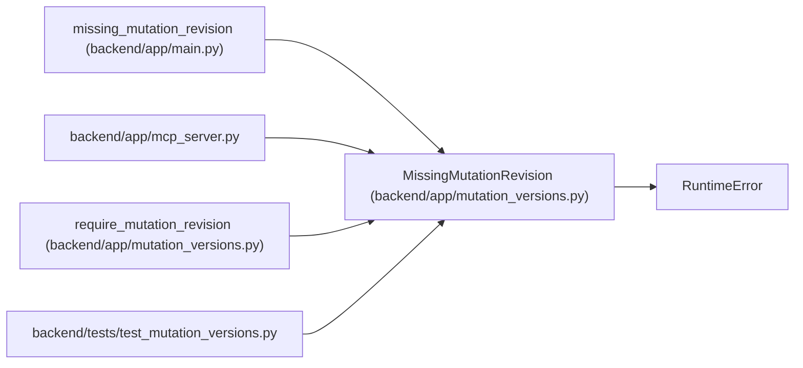

# MissingMutationRevision

**Location:** `backend/app/mutation_versions.py:7`
**Kind:** Class
**Bases:** `RuntimeError`
**Module:** [mutation_versions](../modules/mutation_versions.md)

## Description

A supported command omitted its optimistic input revision.

## Attributes

*No annotated attributes found.*

## Methods

| Method | Signature | Decorators | Description |
|--------|-----------|------------|-------------|
| `__init__` | `(field: str, resource: str, resource_id: int)` | — | — |
| `detail` | `()` | — | — |

## Relationships

<!-- Auto-generated relationship summary. Do not edit by hand. -->

### Summary

| Module | Methods | Attributes |
|---|---:|---|
| [mutation_versions](../modules/mutation_versions.md) | 2 | — |

### Structure

| Kind | Entity | Module |
|---|---|---|
| Base | `RuntimeError` | — |

### References

| Reference | Kind | Source | Call sites |
|---|---|---|---:|
| `missing_mutation_revision` | type_reference | [app_main](../modules/app_main.md) | — |
| `mcp_server` | import | [mcp_server](../modules/mcp_server.md) | — |
| `require_mutation_revision` | call | [mutation_versions](../modules/mutation_versions.md) | 1 |
| `test_mutation_versions` | import | [test_mutation_versions](../modules/test_mutation_versions.md) | — |
