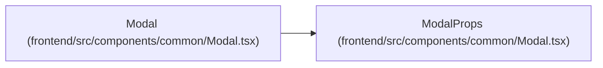

# ModalProps

**Location:** `frontend/src/components/common/Modal.tsx:8`
**Kind:** Class
**Bases:** —
**Module:** [Modal](../modules/Modal.md)

## Description

_Auto-generated from `ModalProps` in `frontend/src/components/common/Modal.tsx`._

## Attributes

| Name | Type | Required | Default | Description |
|------|------|----------|---------|-------------|
| `open` | `boolean` | Yes | — | — |
| `title` | `ReactNode` | Yes | — | — |
| `description` | `ReactNode` | No | — | — |
| `children` | `ReactNode` | No | — | — |
| `footer` | `ReactNode` | No | — | — |
| `onClose` | `() => void` | Yes | — | — |
| `closeLabel` | `string` | Yes | — | — |
| `initialFocusRef` | `RefObject<HTMLElement \| null>` | No | — | — |
| `closeOnBackdropClick` | `boolean` | No | — | — |
| `closeDisabled` | `boolean` | No | — | — |
| `fullScreen` | `boolean` | No | — | — |
| `className` | `string` | No | — | — |
| `contentClassName` | `string` | No | — | — |

## Methods

*No public methods. Inherits from base classes.*

## Relationships

<!-- Auto-generated relationship summary. Do not edit by hand. -->

### Summary

| Module | Methods | Attributes |
|---|---:|---|
| [Modal](../modules/Modal.md) | 0 | `children`, `className`, `closeDisabled`, `closeLabel`, `closeOnBackdropClick`, `contentClassName`, `description`, `footer`, `fullScreen`, `initialFocusRef`, `onClose`, `open` |

### References

| Reference | Kind | Source | Call sites |
|---|---|---|---:|
| `Modal` | type_reference | [Modal](../modules/Modal.md) | — |
