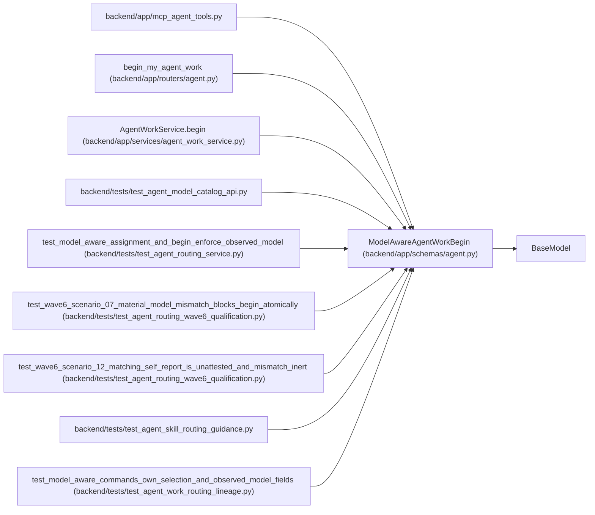

# ModelAwareAgentWorkBegin

**Location:** `backend/app/schemas/agent.py:869`
**Kind:** Pydantic model
**Bases:** `BaseModel`
**Module:** [schemas_agent](../modules/schemas_agent.md)

## Description

Atomically begin only the model binding selected by routing.

## Model Configuration

| Setting | Value | Source |
|---------|-------|--------|
| `extra` | `'forbid'` | model_config |

## Validators

| Method | Scope | Fields | Mode | Options |
|--------|-------|--------|------|---------|
| `normalize_resolved_model_id` | field | resolved_model_id | after | — |
| `validate_metadata_size` | field | metadata | after | — |

## Attributes

| Name | Type | Wire name | Required | Nullable | Default | Constraints | Examples | Description |
|------|------|-----------|----------|----------|---------|-------------|-------------|----------|
| `assignment_id` | `int` | `assignment_id` | Yes | No | — | ge=1 | — | — |
| `queue_revision` | `int` | `queue_revision` | Yes | No | — | ge=1 | — | — |
| `model_binding_id` | `int` | `model_binding_id` | Yes | No | — | ge=1 | — | — |
| `model_binding_revision` | `int` | `model_binding_revision` | Yes | No | — | ge=1 | — | — |
| `resolved_model_id` | `str` | `resolved_model_id` | Yes | No | — | min_length=1; max_length=255 | — | — |
| `lease_seconds` | `int` | `lease_seconds` | No | No | `3600` | ge=60; le=86400 | — | — |
| `trace_id` | `Optional[str]` | `trace_id` | No | Yes | `None` | max_length=255 | — | — |
| `tool_name` | `Optional[str]` | `tool_name` | No | Yes | `None` | max_length=255 | — | — |
| `metadata` | `dict[str, Any]` | `metadata` | No | No | factory: `dict` | max_length=unknown (MAX_AGENT_JSON_FIELDS) | — | — |

## Methods

| Method | Signature | Decorators | Description |
|--------|-----------|------------|-------------|
| `normalize_resolved_model_id` | `(value: str) -> str` | `@field_validator('resolved_model_id')`, `@classmethod` | — |
| `validate_metadata_size` | `(value: dict[str, Any]) -> dict[str, Any]` | `@field_validator('metadata')`, `@classmethod` | — |

## Relationships

<!-- Auto-generated relationship summary. Do not edit by hand. -->

### Summary

| Module | Methods | Attributes |
|---|---:|---|
| [schemas_agent](../modules/schemas_agent.md) | 2 | `assignment_id`, `lease_seconds`, `metadata`, `model_binding_id`, `model_binding_revision`, `queue_revision`, `resolved_model_id`, `tool_name`, `trace_id` |

### Structure

| Kind | Entity | Module |
|---|---|---|
| Base | `BaseModel` | — |

### References

| Reference | Kind | Source | Call sites |
|---|---|---|---:|
| `mcp_agent_tools` | import | [mcp_agent_tools](../modules/mcp_agent_tools.md) | — |
| `begin_my_agent_work` | type_reference | [routers_agent](../modules/routers_agent.md) | — |
| `AgentWorkService.begin` | type_reference | [agent_work_service](../modules/agent_work_service.md) | — |
| `test_agent_model_catalog_api` | import | [test_agent_model_catalog_api](../modules/test_agent_model_catalog_api.md) | — |
| `test_model_aware_assignment_and_begin_enforce_observed_model` | call | [test_agent_routing_service](../modules/test_agent_routing_service.md) | 2 |
| `test_wave6_scenario_07_material_model_mismatch_blocks_begin_atomically` | call | [test_agent_routing_wave6_qualification](../modules/test_agent_routing_wave6_qualification.md) | 1 |
| `test_wave6_scenario_12_matching_self_report_is_unattested_and_mismatch_inert` | call | [test_agent_routing_wave6_qualification](../modules/test_agent_routing_wave6_qualification.md) | 2 |
| `test_agent_skill_routing_guidance` | import | [test_agent_skill_routing_guidance](../modules/test_agent_skill_routing_guidance.md) | — |
| `test_model_aware_commands_own_selection_and_observed_model_fields` | call | [test_agent_work_routing_lineage](../modules/test_agent_work_routing_lineage.md) | 1 |
