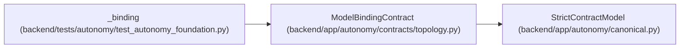

# ModelBindingContract

**Location:** `backend/app/autonomy/contracts/topology.py:98`
**Kind:** Pydantic model
**Bases:** `StrictContractModel`
**Module:** [topology](../modules/topology.md)

## Description

_Auto-generated from `ModelBindingContract` in `backend/app/autonomy/contracts/topology.py`._

## Validators

| Method | Scope | Fields | Mode | Options |
|--------|-------|--------|------|---------|
| `normalized_tags` | field | tool_tags, data_policy_tags | after | — |

## Attributes

| Name | Type | Wire name | Required | Nullable | Default | Constraints | Examples | Description |
|------|------|-----------|----------|----------|---------|-------------|-------------|----------|
| `binding_key` | `str` | `binding_key` | Yes | No | — | pattern=unknown (LOGICAL_KEY_PATTERN) | — | — |
| `catalog_key` | `str` | `catalog_key` | Yes | No | — | pattern=unknown (LOGICAL_KEY_PATTERN) | — | — |
| `minimum_reasoning_tier` | `int` | `minimum_reasoning_tier` | Yes | No | — | ge=1; le=3 | — | — |
| `minimum_context_tier` | `Literal['small', 'medium', 'large']` | `minimum_context_tier` | Yes | No | — | — | — | — |
| `tool_tags` | `tuple[str, ...]` | `tool_tags` | No | No | `()` | max_length=128 | — | — |
| `data_policy_tags` | `tuple[str, ...]` | `data_policy_tags` | No | No | `()` | max_length=128 | — | — |
| `is_default` | `bool` | `is_default` | Yes | No | — | — | — | — |

## Methods

| Method | Signature | Decorators | Description |
|--------|-----------|------------|-------------|
| `normalized_tags` | `(value: tuple[str, ...]) -> tuple[str, ...]` | `@field_validator('tool_tags', 'data_policy_tags')`, `@classmethod` | — |

## Relationships

<!-- Auto-generated relationship summary. Do not edit by hand. -->

### Summary

| Module | Methods | Attributes |
|---|---:|---|
| [topology](../modules/topology.md) | 1 | `binding_key`, `catalog_key`, `data_policy_tags`, `is_default`, `minimum_context_tier`, `minimum_reasoning_tier`, `tool_tags` |

### Structure

| Kind | Entity | Module |
|---|---|---|
| Base | `StrictContractModel` | [autonomy_canonical](../modules/autonomy_canonical.md) |

### References

| Reference | Kind | Source | Call sites |
|---|---|---|---:|
| `_binding` | call | [test_autonomy_foundation](../modules/test_autonomy_foundation.md) | 1 |
| `_binding` | type_reference | [test_autonomy_foundation](../modules/test_autonomy_foundation.md) | — |
