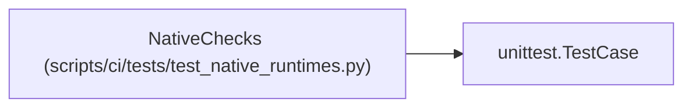

# NativeChecks

**Location:** `scripts/ci/tests/test_native_runtimes.py:73`
**Kind:** Class
**Bases:** `unittest.TestCase`
**Module:** [test_native_runtimes](../modules/test_native_runtimes.md)

## Description

_Auto-generated from `NativeChecks` in `scripts/ci/tests/test_native_runtimes.py`._

## Attributes

*No annotated attributes found.*

## Methods

| Method | Signature | Decorators | Description |
|--------|-----------|------------|-------------|
| `test_connection_parameters_cannot_override_the_loopback_host` | `()` | — | — |
| `test_service_cleanup_reaps_exited_processes_and_escalates_timeouts` | `()` | — | — |
| `test_application_secrets_are_not_inherited` | `()` | — | — |
| `run_backend` | `(*, write_results, remote = False)` | — | — |
| `test_empty_results_cannot_be_reported_as_success` | `()` | — | — |
| `test_both_database_results_are_required_and_recorded` | `()` | — | — |
| `test_remote_database_is_rejected_before_any_command` | `()` | — | — |

## Relationships

<!-- Auto-generated relationship summary. Do not edit by hand. -->

### Summary

| Module | Methods | Attributes |
|---|---:|---|
| [test_native_runtimes](../modules/test_native_runtimes.md) | 7 | — |

### Structure

| Kind | Entity | Module |
|---|---|---|
| Base | `unittest.TestCase` | — |
