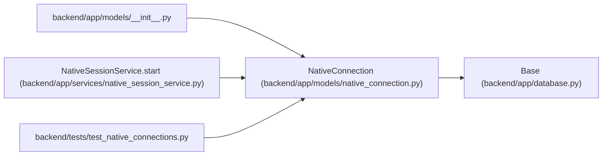

# NativeConnection

**Location:** `backend/app/models/native_connection.py:12`
**Kind:** Class
**Bases:** `Base`
**Module:** [native_connection](../modules/native_connection.md)

## Description

Stores a hashed request identity, S256 challenge, verification code, bounded expiry, and approving browser session. It retains neither the device verifier nor the issued native token. Consumption is conditional and transactional with session issuance.

## Attributes

| Name | Type | Default | Description |
|------|------|---------|-------------|
| `request_hash` | `Mapped[str]` | `mapped_column(String(64), primary_key=True)` | — |
| `code_challenge` | `Mapped[str]` | `mapped_column(String(43), nullable=False)` | — |
| `verification_code` | `Mapped[str]` | `mapped_column(String(9), nullable=False)` | — |
| `request_ip_hash` | `Mapped[str]` | `mapped_column(String(64), nullable=False, index=True)` | — |
| `created_at` | `Mapped[datetime]` | `mapped_column(UTCDateTime(), default=utc_now, nullable=False)` | — |
| `expires_at` | `Mapped[datetime]` | `mapped_column(UTCDateTime(), nullable=False, index=True)` | — |
| `approved_session_id` | `Mapped[int \| None]` | `mapped_column(ForeignKey('user_sessions.id', ondelete='CASCADE'))` | — |
| `consumed_at` | `Mapped[datetime \| None]` | `mapped_column(UTCDateTime())` | — |

## Methods

*No public methods. Inherits from base classes.*

## Relationships

<!-- Auto-generated relationship summary. Do not edit by hand. -->

### Summary

| Module | Methods | Attributes |
|---|---:|---|
| [native_connection](../modules/native_connection.md) | 0 | `approved_session_id`, `code_challenge`, `consumed_at`, `created_at`, `expires_at`, `request_hash`, `request_ip_hash`, `verification_code` |

### Structure

| Kind | Entity | Module |
|---|---|---|
| Base | `Base` | [app_database](../modules/app_database.md) |

### References

| Reference | Kind | Source | Call sites |
|---|---|---|---:|
| `__init__` | import | [models___init__](../modules/models___init__.md) | — |
| `NativeSessionService.start` | call | [native_session_service](../modules/native_session_service.md) | 1 |
| `test_native_connections` | import | [test_native_connections](../modules/test_native_connections.md) | — |
