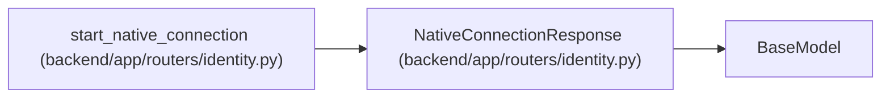

# NativeConnectionResponse

**Location:** `backend/app/routers/identity.py:48`
**Kind:** Pydantic model
**Bases:** `BaseModel`
**Module:** [routers_identity](../modules/routers_identity.md)

## Description

_Auto-generated from `NativeConnectionResponse` in `backend/app/routers/identity.py`._

## Attributes

| Name | Type | Wire name | Required | Nullable | Default | Constraints | Examples | Description |
|------|------|-----------|----------|----------|---------|-------------|-------------|----------|
| `request_id` | `str` | `request_id` | Yes | No | — | — | — | — |
| `verification_code` | `str` | `verification_code` | Yes | No | — | — | — | — |
| `verification_path` | `str` | `verification_path` | Yes | No | — | — | — | — |
| `expires_at` | `datetime` | `expires_at` | Yes | No | — | — | — | — |

## Methods

*No public methods. Inherits from base classes.*

## Relationships

<!-- Auto-generated relationship summary. Do not edit by hand. -->

### Summary

| Module | Methods | Attributes |
|---|---:|---|
| [routers_identity](../modules/routers_identity.md) | 0 | `expires_at`, `request_id`, `verification_code`, `verification_path` |

### Structure

| Kind | Entity | Module |
|---|---|---|
| Base | `BaseModel` | — |

### References

| Reference | Kind | Source | Call sites |
|---|---|---|---:|
| `start_native_connection` | type_reference | [routers_identity](../modules/routers_identity.md) | — |
