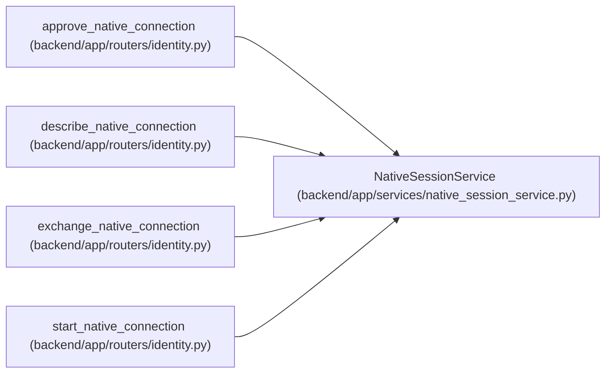

# NativeSessionService

**Location:** `backend/app/services/native_session_service.py:21`
**Kind:** Class
**Bases:** —
**Module:** [native_session_service](../modules/native_session_service.md)

## Description

Coordinates short-lived native connection requests, explicit human browser consent, and a one-use S256 proof exchange. Approval does not grant project access; the resulting session inherits the existing principal and membership policy. Revoked or expired approving sessions and disabled principals cannot issue a native session.

## Attributes

*No annotated attributes found.*

## Methods

| Method | Signature | Decorators | Description |
|--------|-----------|------------|-------------|
| `__init__` | `(db)` | — | — |
| `human` | `()` | — | — |
| `connection` | *(async)* `(request_id)` | — | — |
| `start` | *(async)* `(code_challenge, ip_address)` | `@atomic_command` | — |
| `describe` | *(async)* `(request_id)` | — | — |
| `approve` | *(async)* `(request_id, verification_code)` | `@atomic_command` | — |
| `exchange` | *(async)* `(request_id, code_verifier, ip_address, user_agent)` | `@atomic_command` | — |

## Relationships

<!-- Auto-generated relationship summary. Do not edit by hand. -->

### Summary

| Module | Methods | Attributes |
|---|---:|---|
| [native_session_service](../modules/native_session_service.md) | 7 | — |

### References

| Reference | Kind | Source | Call sites |
|---|---|---|---:|
| `approve_native_connection` | call | [routers_identity](../modules/routers_identity.md) | 1 |
| `describe_native_connection` | call | [routers_identity](../modules/routers_identity.md) | 1 |
| `exchange_native_connection` | call | [routers_identity](../modules/routers_identity.md) | 1 |
| `start_native_connection` | call | [routers_identity](../modules/routers_identity.md) | 1 |
