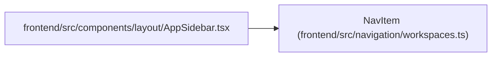

# NavItem

**Location:** `frontend/src/navigation/workspaces.ts:21`
**Kind:** Class
**Bases:** —
**Module:** [workspaces](../modules/workspaces.md)

## Description

_Auto-generated from `NavItem` in `frontend/src/navigation/workspaces.ts`._

## Attributes

| Name | Type | Required | Default | Description |
|------|------|----------|---------|-------------|
| `to` | `string` | Yes | — | — |
| `labelKey` | `string` | Yes | — | — |
| `defaultLabel` | `string` | Yes | — | — |
| `icon` | `LucideIcon` | Yes | — | — |
| `secondary` | `boolean` | No | — | — |

## Methods

*No public methods. Inherits from base classes.*

## Relationships

<!-- Auto-generated relationship summary. Do not edit by hand. -->

### Summary

| Module | Methods | Attributes |
|---|---:|---|
| [workspaces](../modules/workspaces.md) | 0 | `defaultLabel`, `icon`, `labelKey`, `secondary`, `to` |

### References

| Reference | Kind | Source | Call sites |
|---|---|---|---:|
| `AppSidebar` | import | [AppSidebar](../modules/AppSidebar.md) | — |
