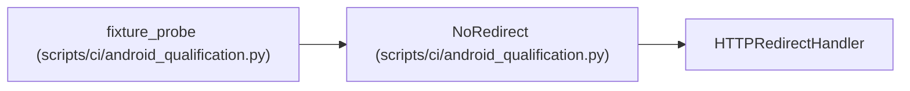

# NoRedirect

**Location:** `scripts/ci/android_qualification.py:69`
**Kind:** Class
**Bases:** `HTTPRedirectHandler`
**Module:** [android_qualification](../modules/android_qualification.md)

## Description

_Auto-generated from `NoRedirect` in `scripts/ci/android_qualification.py`._

## Attributes

*No annotated attributes found.*

## Methods

| Method | Signature | Decorators | Description |
|--------|-----------|------------|-------------|
| `redirect_request` | `(*args, **kwargs)` | — | — |

## Relationships

<!-- Auto-generated relationship summary. Do not edit by hand. -->

### Summary

| Module | Methods | Attributes |
|---|---:|---|
| [android_qualification](../modules/android_qualification.md) | 1 | — |

### Structure

| Kind | Entity | Module |
|---|---|---|
| Base | `HTTPRedirectHandler` | — |

### References

| Reference | Kind | Source | Call sites |
|---|---|---|---:|
| `fixture_probe` | call | [android_qualification](../modules/android_qualification.md) | 1 |
