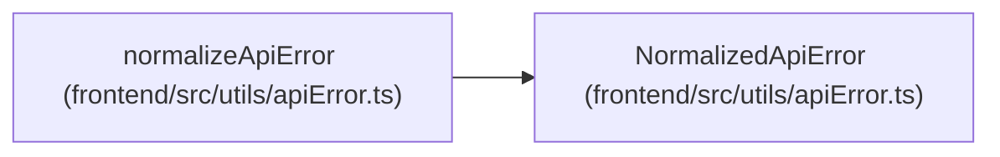

# NormalizedApiError

**Location:** `frontend/src/utils/apiError.ts:8`
**Kind:** Class
**Bases:** —
**Module:** [apiError](../modules/apiError.md)

## Description

_Auto-generated from `NormalizedApiError` in `frontend/src/utils/apiError.ts`._

## Attributes

| Name | Type | Default | Description |
|------|------|---------|-------------|
| `kind` | `ApiErrorKind` | *required* | — |
| `status` | `number` | *required* | — |
| `code` | `string` | *required* | — |
| `message` | `string` | *required* | — |
| `fieldErrors` | `ApiFieldError[]` | *required* | — |
| `details` | `unknown` | *required* | — |

## Methods

*No public methods. Inherits from base classes.*

## Relationships

<!-- Auto-generated relationship summary. Do not edit by hand. -->

### Summary

| Module | Methods | Attributes |
|---|---:|---|
| [apiError](../modules/apiError.md) | 0 | `code`, `details`, `fieldErrors`, `kind`, `message`, `status` |

### References

| Reference | Kind | Source | Call sites |
|---|---|---|---:|
| `normalizeApiError` | type_reference | [apiError](../modules/apiError.md) | — |
