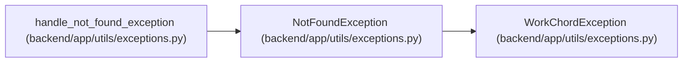

# NotFoundException

**Location:** `backend/app/utils/exceptions.py:20`
**Kind:** Class
**Bases:** `WorkChordException`
**Module:** [exceptions](../modules/exceptions.md)

## Description

Resource not found exception.

## Attributes

*No annotated attributes found.*

## Methods

| Method | Signature | Decorators | Description |
|--------|-----------|------------|-------------|
| `__init__` | `(resource: str, id: int)` | — | — |

## Relationships

<!-- Auto-generated relationship summary. Do not edit by hand. -->

### Summary

| Module | Methods | Attributes |
|---|---:|---|
| [exceptions](../modules/exceptions.md) | 1 | — |

### Structure

| Kind | Entity | Module |
|---|---|---|
| Base | `WorkChordException` | [exceptions](../modules/exceptions.md) |

### References

| Reference | Kind | Source | Call sites |
|---|---|---|---:|
| `handle_not_found_exception` | type_reference | [exceptions](../modules/exceptions.md) | — |
