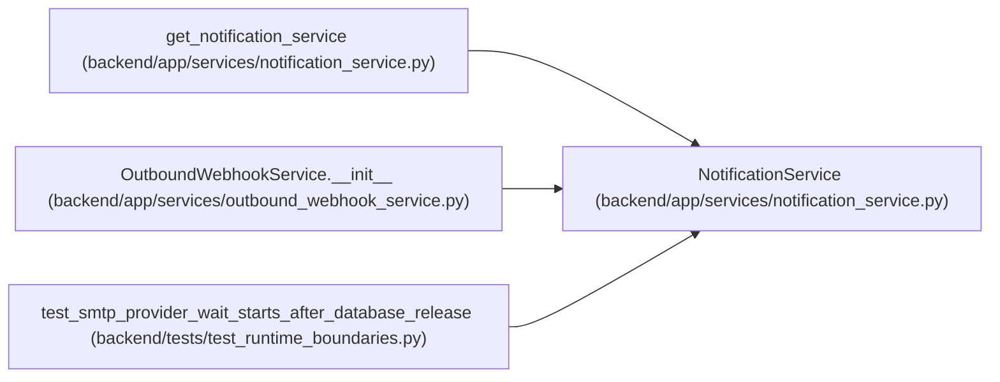

# NotificationService

**Location:** `backend/app/services/notification_service.py:22`
**Kind:** Class
**Bases:** —
**Module:** [notification_service](../modules/notification_service.md)

## Description

Service for sending email notifications about task status changes.

## Attributes

*No annotated attributes found.*

## Methods

| Method | Signature | Decorators | Description |
|--------|-----------|------------|-------------|
| `__init__` | `(db = None)` | — | — |
| `settings` | `()` | `@property` | Get environment-backed settings for sync legacy callers. |
| `is_enabled` | `() -> bool` | `@property` | Check env-backed notification state for sync legacy callers. |
| `_settings` | *(async)* `()` | — | Get current runtime settings. |
| `_ui_language` | *(async)* `()` | — | Resolve the runtime UI language used for generated notification text. |
| `send_email` | *(async)* `(recipients: list[str], subject: str, body_html: str, body_text: Optional[str] = None) -> bool` | — | Send an email to the specified recipients. |
| `notify_status_change` | *(async)* `(task_title: str, task_id: int, old_status: str, new_status: str, manager_email: Optional[str], assignee_email: Optional[str], cascade_updates: list[dict], reason: Optional[str] = None) -> bool` | — | Send notification about task status change. |
| `notify_overdue` | *(async)* `(task_title: str, task_id: int, planned_start: date, manager_email: Optional[str], assignee_email: Optional[str]) -> bool` | — | Send notification about overdue task start. |

## Relationships

<!-- Auto-generated relationship summary. Do not edit by hand. -->

### Summary

| Module | Methods | Attributes |
|---|---:|---|
| [notification_service](../modules/notification_service.md) | 8 | — |

### References

| Reference | Kind | Source | Call sites |
|---|---|---|---:|
| `get_notification_service` | call | [notification_service](../modules/notification_service.md) | 2 |
| `get_notification_service` | type_reference | [notification_service](../modules/notification_service.md) | — |
| `OutboundWebhookService.__init__` | call | [outbound_webhook_service](../modules/outbound_webhook_service.md) | 1 |
| `OutboundWebhookService.__init__` | type_reference | [outbound_webhook_service](../modules/outbound_webhook_service.md) | — |
| `test_smtp_provider_wait_starts_after_database_release` | call | [test_runtime_boundaries](../modules/test_runtime_boundaries.md) | 1 |
