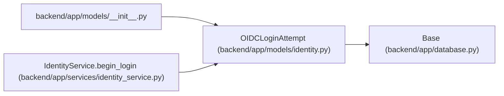

# OIDCLoginAttempt

**Location:** `backend/app/models/identity.py:66`
**Kind:** Class
**Bases:** `Base`
**Module:** [models_identity](../modules/models_identity.md)

## Description

_Auto-generated from `OIDCLoginAttempt` in `backend/app/models/identity.py`._

## Attributes

| Name | Type | Default | Description |
|------|------|---------|-------------|
| `state_hash` | `Mapped[str]` | `mapped_column(String(64), primary_key=True)` | — |
| `browser_hash` | `Mapped[str]` | `mapped_column(String(64), nullable=False)` | — |
| `nonce` | `Mapped[str]` | `mapped_column(String(128), nullable=False)` | — |
| `verifier` | `Mapped[str]` | `mapped_column(String(128), nullable=False)` | — |
| `return_path` | `Mapped[str]` | `mapped_column(String(512), nullable=False)` | — |
| `expires_at` | `Mapped[datetime]` | `mapped_column(UTCDateTime(), nullable=False, index=True)` | — |
| `consumed_at` | `Mapped[datetime \| None]` | `mapped_column(UTCDateTime())` | — |

## Methods

*No public methods. Inherits from base classes.*

## Relationships

<!-- Auto-generated relationship summary. Do not edit by hand. -->

### Summary

| Module | Methods | Attributes |
|---|---:|---|
| [models_identity](../modules/models_identity.md) | 0 | `browser_hash`, `consumed_at`, `expires_at`, `nonce`, `return_path`, `state_hash`, `verifier` |

### Structure

| Kind | Entity | Module |
|---|---|---|
| Base | `Base` | [app_database](../modules/app_database.md) |

### References

| Reference | Kind | Source | Call sites |
|---|---|---|---:|
| `__init__` | import | [models___init__](../modules/models___init__.md) | — |
| `IdentityService.begin_login` | call | [identity_service](../modules/identity_service.md) | 1 |
