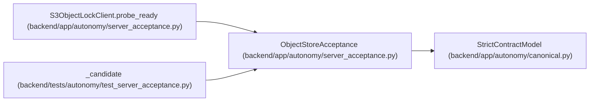

# ObjectStoreAcceptance

**Location:** `backend/app/autonomy/server_acceptance.py:108`
**Kind:** Pydantic model
**Bases:** `StrictContractModel`
**Module:** [autonomy_server_acceptance](../modules/autonomy_server_acceptance.md)

## Description

_Auto-generated from `ObjectStoreAcceptance` in `backend/app/autonomy/server_acceptance.py`._

## Attributes

| Name | Type | Wire name | Required | Nullable | Default | Constraints | Examples | Description |
|------|------|-----------|----------|----------|---------|-------------|-------------|----------|
| `implementation` | `Literal['minio-s3-object-lock']` | `implementation` | No | No | `'minio-s3-object-lock'` | — | — | — |
| `endpoint` | `str` | `endpoint` | Yes | No | — | pattern='^https?://[^@\\s]+$' | — | — |
| `bucket` | `str` | `bucket` | Yes | No | — | pattern='^[a-z0-9][a-z0-9.-]{1,62}$' | — | — |
| `ready` | `Literal[True]` | `ready` | No | No | `True` | — | — | — |

## Methods

*No public methods. Inherits from base classes.*

## Relationships

<!-- Auto-generated relationship summary. Do not edit by hand. -->

### Summary

| Module | Methods | Attributes |
|---|---:|---|
| [autonomy_server_acceptance](../modules/autonomy_server_acceptance.md) | 0 | `bucket`, `endpoint`, `implementation`, `ready` |

### Structure

| Kind | Entity | Module |
|---|---|---|
| Base | `StrictContractModel` | [autonomy_canonical](../modules/autonomy_canonical.md) |

### References

| Reference | Kind | Source | Call sites |
|---|---|---|---:|
| `S3ObjectLockClient.probe_ready` | call | [autonomy_server_acceptance](../modules/autonomy_server_acceptance.md) | 1 |
| `S3ObjectLockClient.probe_ready` | type_reference | [autonomy_server_acceptance](../modules/autonomy_server_acceptance.md) | — |
| `_candidate` | call | [test_server_acceptance](../modules/test_server_acceptance.md) | 1 |
