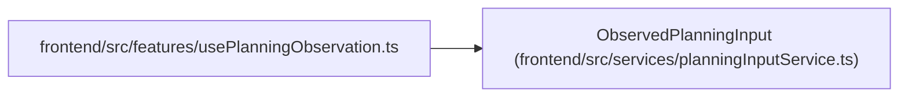

# ObservedPlanningInput

**Location:** `frontend/src/services/planningInputService.ts:4`
**Kind:** Class
**Bases:** —
**Module:** [planningInputService](../modules/planningInputService.md)

## Description

_Auto-generated from `ObservedPlanningInput` in `frontend/src/services/planningInputService.ts`._

## Attributes

| Name | Type | Required | Default | Description |
|------|------|----------|---------|-------------|
| `kind` | `PlanningInputKind` | Yes | — | — |
| `resource_id` | `number` | Yes | — | — |
| `resource` | `T` | Yes | — | — |
| `expected_revisions` | `Record<number, number>` | Yes | — | — |
| `complete` | `true` | Yes | — | — |

## Methods

*No public methods. Inherits from base classes.*

## Relationships

<!-- Auto-generated relationship summary. Do not edit by hand. -->

### Summary

| Module | Methods | Attributes |
|---|---:|---|
| [planningInputService](../modules/planningInputService.md) | 0 | `complete`, `expected_revisions`, `kind`, `resource`, `resource_id` |

### References

| Reference | Kind | Source | Call sites |
|---|---|---|---:|
| `usePlanningObservation` | import | [usePlanningObservation](../modules/usePlanningObservation.md) | — |
