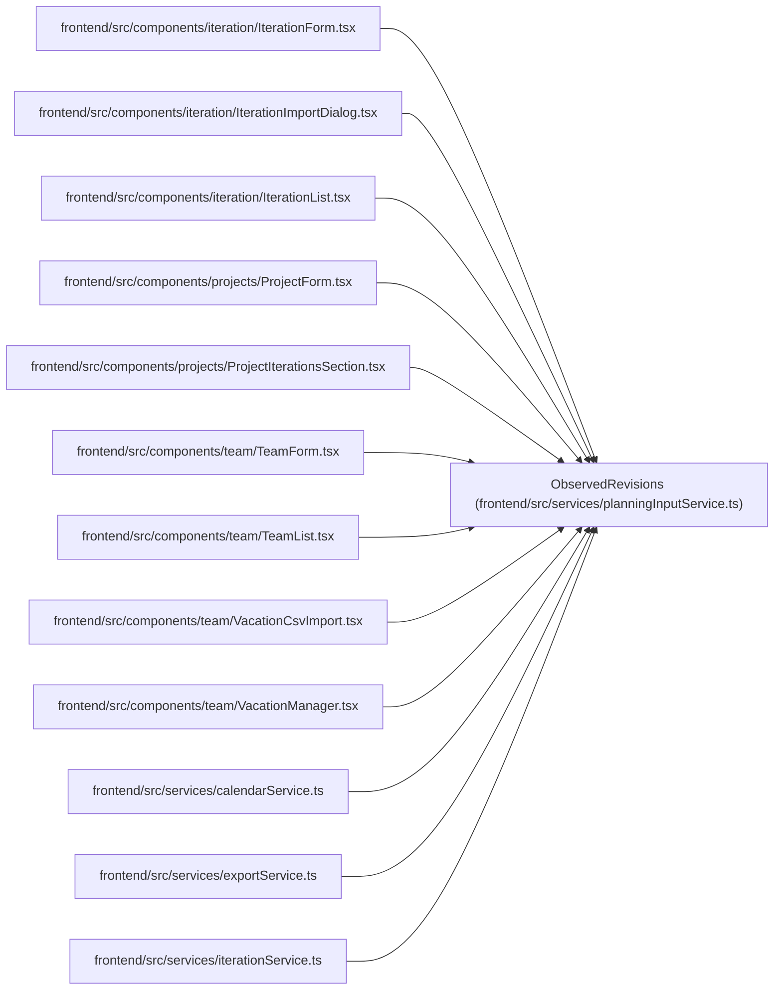

# ObservedRevisions

**Location:** `frontend/src/services/planningInputService.ts:13`
**Kind:** Type alias
**Bases:** —
**Module:** [planningInputService](../modules/planningInputService.md)

## Description

_Auto-generated from `ObservedRevisions` in `frontend/src/services/planningInputService.ts`._

## Attributes

*No annotated attributes found.*

## Methods

*No public methods. Inherits from base classes.*

## Relationships

<!-- Auto-generated relationship summary. Do not edit by hand. -->

### Summary

| Module | Methods | Attributes |
|---|---:|---|
| [planningInputService](../modules/planningInputService.md) | 0 | — |

### References

| Reference | Kind | Source | Call sites |
|---|---|---|---:|
| `IterationForm` | import | [IterationForm](../modules/IterationForm.md) | — |
| `IterationImportDialog` | import | [IterationImportDialog](../modules/IterationImportDialog.md) | — |
| `IterationList` | import | [IterationList](../modules/IterationList.md) | — |
| `ProjectForm` | import | [ProjectForm](../modules/ProjectForm.md) | — |
| `ProjectIterationsSection` | import | [ProjectIterationsSection](../modules/ProjectIterationsSection.md) | — |
| `TeamForm` | import | [TeamForm](../modules/TeamForm.md) | — |
| `TeamList` | import | [TeamList](../modules/TeamList.md) | — |
| `VacationCsvImport` | import | [VacationCsvImport](../modules/VacationCsvImport.md) | — |
| `VacationManager` | import | [VacationManager](../modules/VacationManager.md) | — |
| `calendarService` | import | [calendarService](../modules/calendarService.md) | — |
| `exportService` | import | [exportService](../modules/exportService.md) | — |
| `iterationService` | import | [iterationService](../modules/iterationService.md) | — |

> References: showing 12 of 15 logical references; 3 omitted by the 12-row generated summary limit.
