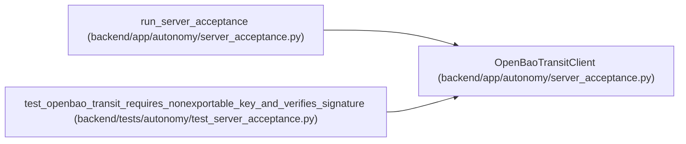

# OpenBaoTransitClient

**Location:** `backend/app/autonomy/server_acceptance.py:309`
**Kind:** Class
**Bases:** —
**Module:** [autonomy_server_acceptance](../modules/autonomy_server_acceptance.md)

## Description

Small HTTP adapter for the OpenBao/Vault-compatible Transit API.

## Attributes

*No annotated attributes found.*

## Methods

| Method | Signature | Decorators | Description |
|--------|-----------|------------|-------------|
| `__init__` | `(*, base_url: str, token: str, key_name: str, timeout_seconds: float, client: httpx.Client \| None = None) -> None` | — | — |
| `close` | `() -> None` | — | — |
| `_request` | `(method: str, path: str, *, payload: dict[str, object] \| None = None) -> dict[str, object]` | — | — |
| `probe` | `() -> TransitSignerAcceptance` | — | — |
| `sign_and_verify` | `(payload: bytes, *, signer: TransitSignerAcceptance) -> str` | — | — |
| `probe_and_sign` | `(payload: bytes) -> tuple[TransitSignerAcceptance, str]` | — | Compatibility helper for callers that need one probe/sign operation. |

## Relationships

<!-- Auto-generated relationship summary. Do not edit by hand. -->

### Summary

| Module | Methods | Attributes |
|---|---:|---|
| [autonomy_server_acceptance](../modules/autonomy_server_acceptance.md) | 6 | — |

### References

| Reference | Kind | Source | Call sites |
|---|---|---|---:|
| `run_server_acceptance` | call | [autonomy_server_acceptance](../modules/autonomy_server_acceptance.md) | 1 |
| `test_openbao_transit_requires_nonexportable_key_and_verifies_signature` | call | [test_server_acceptance](../modules/test_server_acceptance.md) | 1 |
