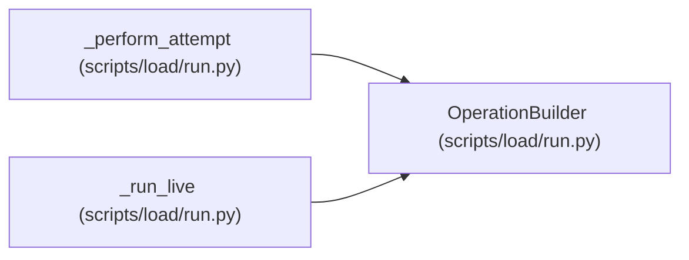

# OperationBuilder

**Location:** `scripts/load/run.py:225`
**Kind:** Class
**Bases:** —
**Module:** [run](../modules/run.md)

## Description

Build bounded, deterministic request payloads without response lookups.

## Attributes

*No annotated attributes found.*

## Methods

| Method | Signature | Decorators | Description |
|--------|-----------|------------|-------------|
| `__init__` | `(credentials: Mapping[str, Any], seed: int, *, entity_plan: list[str] \| None = None, run_namespace: str = 'local') -> None` | — | — |
| `_next` | `(operation_id: str) -> int` | — | — |
| `_next_entity` | `(operation_id: str) -> int` | — | — |
| `_category` | `(counter: int) -> str` | — | — |
| `_project` | `(counter: int, *, avoid_hot: bool = False) -> int` | — | — |
| `_iteration` | `(counter: int, *, avoid_hot: bool = False) -> int` | — | — |
| `_task` | `(counter: int, *, partition: int = 0) -> int` | — | — |
| `rest_request` | `(operation: Mapping[str, Any]) -> tuple[str, str, dict[str, Any], str]` | — | — |
| `mcp_arguments` | `(operation_id: str, client: 'VirtualClient') -> dict[str, Any]` | — | — |

## Relationships

<!-- Auto-generated relationship summary. Do not edit by hand. -->

### Summary

| Module | Methods | Attributes |
|---|---:|---|
| [run](../modules/run.md) | 9 | — |

### References

| Reference | Kind | Source | Call sites |
|---|---|---|---:|
| `_perform_attempt` | type_reference | [run](../modules/run.md) | — |
| `_run_live` | call | [run](../modules/run.md) | 1 |
