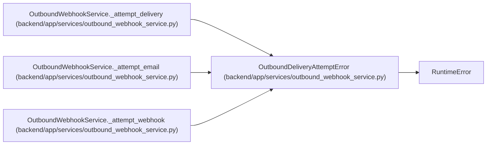

# OutboundDeliveryAttemptError

**Location:** `backend/app/services/outbound_webhook_service.py:142`
**Kind:** Class
**Bases:** `RuntimeError`
**Module:** [outbound_webhook_service](../modules/outbound_webhook_service.md)

## Description

Classify a transport failure as retryable or terminal.

## Attributes

*No annotated attributes found.*

## Methods

| Method | Signature | Decorators | Description |
|--------|-----------|------------|-------------|
| `__init__` | `(message: str, *, retryable: bool)` | — | — |

## Relationships

<!-- Auto-generated relationship summary. Do not edit by hand. -->

### Summary

| Module | Methods | Attributes |
|---|---:|---|
| [outbound_webhook_service](../modules/outbound_webhook_service.md) | 1 | — |

### Structure

| Kind | Entity | Module |
|---|---|---|
| Base | `RuntimeError` | — |

### References

| Reference | Kind | Source | Call sites |
|---|---|---|---:|
| `OutboundWebhookService._attempt_delivery` | call | [outbound_webhook_service](../modules/outbound_webhook_service.md) | 1 |
| `OutboundWebhookService._attempt_email` | call | [outbound_webhook_service](../modules/outbound_webhook_service.md) | 1 |
| `OutboundWebhookService._attempt_webhook` | call | [outbound_webhook_service](../modules/outbound_webhook_service.md) | 2 |
