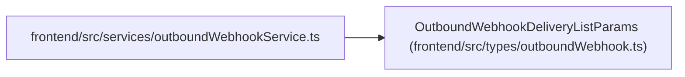

# OutboundWebhookDeliveryListParams

**Location:** `frontend/src/types/outboundWebhook.ts:61`
**Kind:** Class
**Bases:** —
**Module:** [outboundWebhook](../modules/outboundWebhook.md)

## Description

_Auto-generated from `OutboundWebhookDeliveryListParams` in `frontend/src/types/outboundWebhook.ts`._

## Attributes

| Name | Type | Default | Description |
|------|------|---------|-------------|
| `target_id` | `number \| null` | *required* | — |
| `status` | `OutboundWebhookDeliveryStatus \| null` | *required* | — |
| `limit` | `number` | *required* | — |

## Methods

*No public methods. Inherits from base classes.*

## Relationships

<!-- Auto-generated relationship summary. Do not edit by hand. -->

### Summary

| Module | Methods | Attributes |
|---|---:|---|
| [outboundWebhook](../modules/outboundWebhook.md) | 0 | `limit`, `status`, `target_id` |

### References

| Reference | Kind | Source | Call sites |
|---|---|---|---:|
| `outboundWebhookService` | import | [outboundWebhookService](../modules/outboundWebhookService.md) | — |
