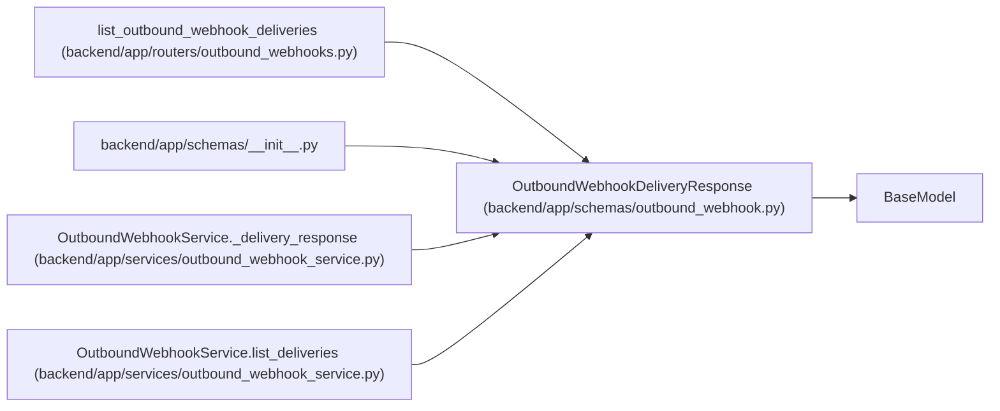

# OutboundWebhookDeliveryResponse

**Location:** `backend/app/schemas/outbound_webhook.py:165`
**Kind:** Pydantic model
**Bases:** `BaseModel`
**Module:** [schemas_outbound_webhook](../modules/schemas_outbound_webhook.md)

## Description

Delivery attempt response with embedded event details.

## Model Configuration

| Setting | Value | Source |
|---------|-------|--------|
| `from_attributes` | `True` | model_config |

## Attributes

| Name | Type | Wire name | Required | Nullable | Default | Constraints | Examples | Description |
|------|------|-----------|----------|----------|---------|-------------|-------------|----------|
| `id` | `int` | `id` | Yes | No | — | — | — | — |
| `target_id` | `Optional[int]` | `target_id` | No | Yes | `None` | — | — | — |
| `event_id` | `int` | `event_id` | Yes | No | — | — | — | — |
| `target_name` | `str` | `target_name` | Yes | No | — | — | — | — |
| `target_url` | `str` | `target_url` | Yes | No | — | — | — | — |
| `channel` | `str` | `channel` | No | No | `'webhook'` | — | — | — |
| `status` | `str` | `status` | Yes | No | — | — | — | — |
| `attempt_count` | `int` | `attempt_count` | Yes | No | — | — | — | — |
| `max_attempts` | `int` | `max_attempts` | No | No | `5` | — | — | — |
| `last_http_status` | `Optional[int]` | `last_http_status` | No | Yes | `None` | — | — | — |
| `last_error` | `Optional[str]` | `last_error` | No | Yes | `None` | — | — | — |
| `last_response_body` | `Optional[str]` | `last_response_body` | No | Yes | `None` | — | — | — |
| `last_attempt_at` | `Optional[datetime]` | `last_attempt_at` | No | Yes | `None` | — | — | — |
| `next_retry_at` | `Optional[datetime]` | `next_retry_at` | No | Yes | `None` | — | — | — |
| `terminal_at` | `Optional[datetime]` | `terminal_at` | No | Yes | `None` | — | — | — |
| `delivered_at` | `Optional[datetime]` | `delivered_at` | No | Yes | `None` | — | — | — |
| `created_at` | `datetime` | `created_at` | Yes | No | — | — | — | — |
| `updated_at` | `datetime` | `updated_at` | Yes | No | — | — | — | — |
| `event` | `OutboundWebhookEventResponse` | `event` | Yes | No | — | — | — | — |

## Methods

*No public methods. Inherits from base classes.*

## Relationships

<!-- Auto-generated relationship summary. Do not edit by hand. -->

### Summary

| Module | Methods | Attributes |
|---|---:|---|
| [schemas_outbound_webhook](../modules/schemas_outbound_webhook.md) | 0 | `attempt_count`, `channel`, `created_at`, `delivered_at`, `event`, `event_id`, `id`, `last_attempt_at`, `last_error`, `last_http_status`, `last_response_body`, `max_attempts` |

### Structure

| Kind | Entity | Module |
|---|---|---|
| Base | `BaseModel` | — |

### References

| Reference | Kind | Source | Call sites |
|---|---|---|---:|
| `list_outbound_webhook_deliveries` | type_reference | [outbound_webhooks](../modules/outbound_webhooks.md) | — |
| `__init__` | import | [schemas___init__](../modules/schemas___init__.md) | — |
| `OutboundWebhookService._delivery_response` | type_reference | [outbound_webhook_service](../modules/outbound_webhook_service.md) | — |
| `OutboundWebhookService.list_deliveries` | type_reference | [outbound_webhook_service](../modules/outbound_webhook_service.md) | — |
