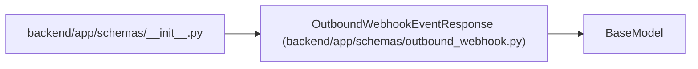

# OutboundWebhookEventResponse

**Location:** `backend/app/schemas/outbound_webhook.py:151`
**Kind:** Pydantic model
**Bases:** `BaseModel`
**Module:** [schemas_outbound_webhook](../modules/schemas_outbound_webhook.md)

## Description

Normalized outbound webhook event response.

## Model Configuration

| Setting | Value | Source |
|---------|-------|--------|
| `from_attributes` | `True` | model_config |

## Attributes

| Name | Type | Wire name | Required | Nullable | Default | Constraints | Examples | Description |
|------|------|-----------|----------|----------|---------|-------------|-------------|----------|
| `id` | `int` | `id` | Yes | No | — | — | — | — |
| `event_id` | `str` | `event_id` | Yes | No | — | — | — | — |
| `event_type` | `str` | `event_type` | Yes | No | — | — | — | — |
| `entity_type` | `str` | `entity_type` | Yes | No | — | — | — | — |
| `entity_id` | `Optional[int]` | `entity_id` | No | Yes | `None` | — | — | — |
| `payload_json` | `dict[str, Any]` | `payload_json` | Yes | No | — | — | — | — |
| `occurred_at` | `datetime` | `occurred_at` | Yes | No | — | — | — | — |

## Methods

*No public methods. Inherits from base classes.*

## Relationships

<!-- Auto-generated relationship summary. Do not edit by hand. -->

### Summary

| Module | Methods | Attributes |
|---|---:|---|
| [schemas_outbound_webhook](../modules/schemas_outbound_webhook.md) | 0 | `entity_id`, `entity_type`, `event_id`, `event_type`, `id`, `occurred_at`, `payload_json` |

### Structure

| Kind | Entity | Module |
|---|---|---|
| Base | `BaseModel` | — |

### References

| Reference | Kind | Source | Call sites |
|---|---|---|---:|
| `__init__` | import | [schemas___init__](../modules/schemas___init__.md) | — |
