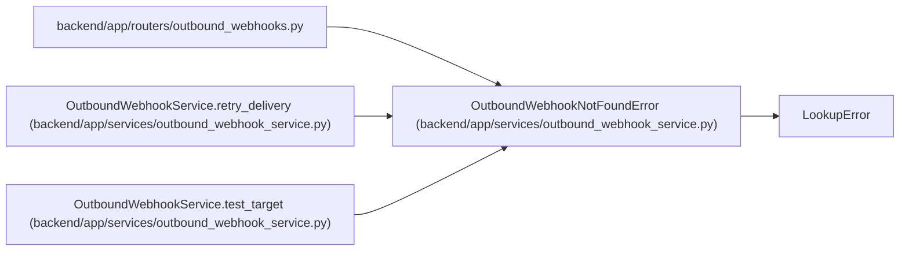

# OutboundWebhookNotFoundError

**Location:** `backend/app/services/outbound_webhook_service.py:138`
**Kind:** Class
**Bases:** `LookupError`
**Module:** [outbound_webhook_service](../modules/outbound_webhook_service.md)

## Description

Raised when an outbound webhook target or delivery cannot be found.

## Attributes

*No annotated attributes found.*

## Methods

*No public methods. Inherits from base classes.*

## Relationships

<!-- Auto-generated relationship summary. Do not edit by hand. -->

### Summary

| Module | Methods | Attributes |
|---|---:|---|
| [outbound_webhook_service](../modules/outbound_webhook_service.md) | 0 | — |

### Structure

| Kind | Entity | Module |
|---|---|---|
| Base | `LookupError` | — |

### References

| Reference | Kind | Source | Call sites |
|---|---|---|---:|
| `outbound_webhooks` | import | [outbound_webhooks](../modules/outbound_webhooks.md) | — |
| `OutboundWebhookService.retry_delivery` | call | [outbound_webhook_service](../modules/outbound_webhook_service.md) | 1 |
| `OutboundWebhookService.test_target` | call | [outbound_webhook_service](../modules/outbound_webhook_service.md) | 1 |
