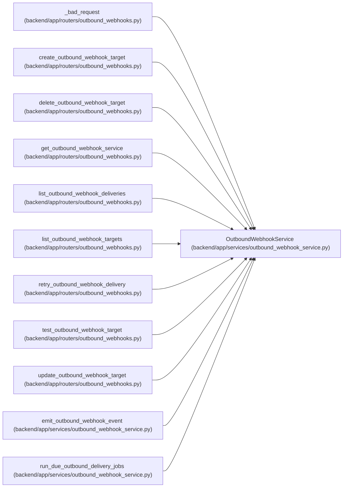

# OutboundWebhookService

**Location:** `backend/app/services/outbound_webhook_service.py:148`
**Kind:** Class
**Bases:** —
**Module:** [outbound_webhook_service](../modules/outbound_webhook_service.md)

## Description

Manage outbound webhook targets and deliver matching domain events.

## Attributes

*No annotated attributes found.*

## Methods

| Method | Signature | Decorators | Description |
|--------|-----------|------------|-------------|
| `__init__` | `(db: AsyncSession, *, transport: Optional[httpx.AsyncBaseTransport] = None, timeout_seconds: float = 5.0, notification_service: Optional[NotificationService] = None, retry_base_seconds: int = DEFAULT_RETRY_BASE_SECONDS, retry_max_seconds: int = DEFAULT_RETRY_MAX_SECONDS, lease_seconds: int = DEFAULT_LEASE_SECONDS)` | — | — |
| `_enum_value` | `(value: Any) -> Any` | — | — |
| `_lease_token` | `(worker_id: str) -> str` | `@staticmethod` | Return a PostgreSQL-safe token within the model's 64-char column. |
| `_json_safe` | `(value: Any) -> Any` | — | Convert domain payloads into values accepted by SQL JSON columns. |
| `_target_response` | `(target: OutboundWebhookTarget) -> OutboundWebhookTargetResponse` | — | Build a target response without exposing the secret. |
| `_delivery_response` | `(delivery: OutboundWebhookDelivery) -> OutboundWebhookDeliveryResponse` | — | Build a delivery response from a loaded delivery model. |
| `_normalize_subscriptions` | `(subscriptions: Sequence[str]) -> list[str]` | — | Validate and deduplicate exact event and wildcard subscription tokens. |
| `_normalize_headers` | `(headers: dict[str, Any]) -> dict[str, str]` | — | Normalize custom headers and protect reserved delivery headers. |
| `_event_matches` | `(event_type: str, subscriptions: Sequence[str]) -> bool` | — | Return whether a target subscription list includes an event. |
| `_delivery_payload` | `(event: OutboundWebhookEvent) -> dict[str, Any]` | — | Build the public delivery payload. |
| `_body_bytes` | `(payload: dict[str, Any]) -> bytes` | — | Serialize payload exactly once for signing and sending. |
| `_signature_header` | `(secret: str, body: bytes) -> str` | — | — |
| `list_targets` | *(async)* `() -> list[OutboundWebhookTargetResponse]` | — | List outbound webhook targets in stable Settings order. |
| `get_target` | *(async)* `(target_id: int) -> Optional[OutboundWebhookTarget]` | — | Load one target by ID. |
| `create_target` | *(async)* `(data: OutboundWebhookTargetCreate) -> OutboundWebhookTargetResponse` | — | Create a webhook target. |
| `update_target` | *(async)* `(target_id: int, data: OutboundWebhookTargetUpdate) -> Optional[OutboundWebhookTargetResponse]` | — | Apply a partial target update. |
| `delete_target` | *(async)* `(target_id: int) -> bool` | — | Delete a target while retaining historical delivery rows. |
| `_enabled_targets` | *(async)* `() -> list[OutboundWebhookTarget]` | — | — |
| `_load_delivery` | *(async)* `(delivery_id: int) -> Optional[OutboundWebhookDelivery]` | — | — |
| `list_deliveries` | *(async)* `(*, target_id: Optional[int] = None, status: Optional[str] = None, channel: str = OutboundDeliveryChannel.WEBHOOK.value, limit: int = 50) -> list[OutboundWebhookDeliveryResponse]` | — | List recent webhook deliveries. |
| `_retry_delay_seconds` | `(attempt_count: int) -> int` | — | Return capped exponential delay after one failed attempt. |
| `_webhook_delivery` | `(event: OutboundWebhookEvent, target: OutboundWebhookTarget, *, max_attempts: int = DEFAULT_MAX_ATTEMPTS) -> OutboundWebhookDelivery` | — | Snapshot one webhook target into a durable queue row. |
| `_email_delivery` | `(event: OutboundWebhookEvent, payload: dict[str, Any]) -> OutboundWebhookDelivery` | — | Create a status-email intent consumed by the same durable worker. |
| `_enqueue_event_records` | *(async)* `(*, event_type: str, entity_type: str, entity_id: Optional[int], data: dict[str, Any], explicit_target: Optional[OutboundWebhookTarget] = None, email_payload: Optional[dict[str, Any]] = None, max_attempts: int = DEFAULT_MAX_ATTEMPTS, commit: bool = True) -> tuple[OutboundWebhookEvent, list[OutboundWebhookDelivery], bool]` | — | Persist an event and every matching transport intent without I/O. |
| `enqueue_event` | *(async)* `(*, event_type: str, entity_type: str, entity_id: Optional[int], data: dict[str, Any], commit: bool = True) -> Optional[OutboundWebhookEvent]` | — | Persist webhook intents; a worker performs external I/O later. |
| `enqueue_status_change` | *(async)* `(*, event_type: str, entity_type: str, entity_id: Optional[int], data: dict[str, Any], email_payload: dict[str, Any], commit: bool = False) -> bool` | — | Atomically enqueue status webhooks and the optional email intent. |
| `emit_event` | *(async)* `(*, event_type: str, entity_type: str, entity_id: Optional[int], data: dict[str, Any]) -> Optional[OutboundWebhookEvent]` | — | Backward-compatible enqueue-only event entry point. |
| `safe_emit_event` | *(async)* `(*, event_type: str, entity_type: str, entity_id: Optional[int], data: dict[str, Any], commit: bool = True) -> None` | — | Compatibility wrapper that propagates local persistence failures. |
| `_attempt_webhook` | *(async)* `(delivery: OutboundWebhookDelivery) -> None` | — | Perform one webhook request using the configuration snapshot. |
| `_attempt_email` | *(async)* `(delivery: OutboundWebhookDelivery) -> None` | — | Perform one status email through the existing notification renderer. |
| `_attempt_delivery` | *(async)* `(delivery: OutboundWebhookDelivery, *, now: Optional[datetime] = None) -> None` | — | Attempt one claimed delivery and persist success, retry, or terminal state. |
| `_claim_conditions` | `(now: datetime) -> tuple[Any, ...]` | — | — |
| `_claim_delivery_id` | *(async)* `(delivery_id: int, *, worker_id: str, now: datetime, require_due: bool = True) -> Optional[str]` | — | Claim one row through a compare-and-set update. |
| `_claim_due_postgresql` | *(async)* `(*, limit: int, worker_id: str, now: datetime) -> list[tuple[int, str]]` | — | Claim one fair PostgreSQL batch under SKIP LOCKED row locks. |
| `claim_due_deliveries` | *(async)* `(*, limit: int = 50, worker_id: Optional[str] = None, now: Optional[datetime] = None) -> list[tuple[int, str]]` | — | Claim due rows so concurrent workers cannot send the same attempt. |
| `process_claimed_delivery` | *(async)* `(delivery_id: int, lease_token: str, *, now: Optional[datetime] = None) -> bool` | — | Perform external I/O only for the worker holding the current lease. |
| `run_due_jobs` | *(async)* `(*, limit: int = 50, worker_id: Optional[str] = None, now: Optional[datetime] = None) -> int` | — | Claim and process one bounded batch with per-target isolation. |
| `test_target` | *(async)* `(target_id: int) -> Optional[OutboundWebhookRetryResponse]` | — | Enqueue and immediately process one test delivery. |
| `retry_delivery` | *(async)* `(delivery_id: int) -> Optional[OutboundWebhookRetryResponse]` | — | Request and immediately process one manual outbound retry. |

## Relationships

<!-- Auto-generated relationship summary. Do not edit by hand. -->

### Summary

| Module | Methods | Attributes |
|---|---:|---|
| [outbound_webhook_service](../modules/outbound_webhook_service.md) | 39 | — |

### References

| Reference | Kind | Source | Call sites |
|---|---|---|---:|
| `_bad_request` | type_reference | [outbound_webhooks](../modules/outbound_webhooks.md) | — |
| `create_outbound_webhook_target` | type_reference | [outbound_webhooks](../modules/outbound_webhooks.md) | — |
| `delete_outbound_webhook_target` | type_reference | [outbound_webhooks](../modules/outbound_webhooks.md) | — |
| `get_outbound_webhook_service` | call | [outbound_webhooks](../modules/outbound_webhooks.md) | 1 |
| `get_outbound_webhook_service` | type_reference | [outbound_webhooks](../modules/outbound_webhooks.md) | — |
| `list_outbound_webhook_deliveries` | type_reference | [outbound_webhooks](../modules/outbound_webhooks.md) | — |
| `list_outbound_webhook_targets` | type_reference | [outbound_webhooks](../modules/outbound_webhooks.md) | — |
| `retry_outbound_webhook_delivery` | type_reference | [outbound_webhooks](../modules/outbound_webhooks.md) | — |
| `test_outbound_webhook_target` | type_reference | [outbound_webhooks](../modules/outbound_webhooks.md) | — |
| `update_outbound_webhook_target` | type_reference | [outbound_webhooks](../modules/outbound_webhooks.md) | — |
| `emit_outbound_webhook_event` | call | [outbound_webhook_service](../modules/outbound_webhook_service.md) | 1 |
| `run_due_outbound_delivery_jobs` | call | [outbound_webhook_service](../modules/outbound_webhook_service.md) | 1 |

> References: showing 12 of 14 logical references; 2 omitted by the 12-row generated summary limit.
