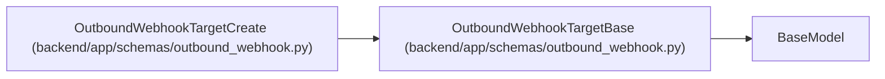

# OutboundWebhookTargetBase

**Location:** `backend/app/schemas/outbound_webhook.py:62`
**Kind:** Pydantic model
**Bases:** `BaseModel`
**Module:** [schemas_outbound_webhook](../modules/schemas_outbound_webhook.md)

## Description

Shared target configuration fields.

## Model Configuration

| Setting | Value | Source |
|---------|-------|--------|
| `extra` | `'forbid'` | model_config |

## Validators

| Method | Scope | Fields | Mode | Options |
|--------|-------|--------|------|---------|
| `validate_url` | field | url | after | — |
| `validate_events` | field | subscribed_events_json | after | — |
| `validate_headers` | field | headers_json | after | — |
| `validate_secret` | field | secret | after | — |

## Attributes

| Name | Type | Wire name | Required | Nullable | Default | Constraints | Examples | Description |
|------|------|-----------|----------|----------|---------|-------------|-------------|----------|
| `name` | `str` | `name` | Yes | No | — | max_length=255; min_length=1 | — | — |
| `description` | `Optional[str]` | `description` | No | Yes | `None` | — | — | — |
| `url` | `str` | `url` | Yes | No | — | max_length=1000; min_length=1 | — | — |
| `enabled` | `bool` | `enabled` | No | No | `True` | — | — | — |
| `subscribed_events_json` | `list[str]` | `subscribed_events_json` | No | No | factory: `list` | — | — | — |
| `secret` | `Optional[str]` | `secret` | No | Yes | `None` | max_length=500 | — | — |
| `headers_json` | `dict[str, str]` | `headers_json` | No | No | factory: `dict` | — | — | — |

## Methods

| Method | Signature | Decorators | Description |
|--------|-----------|------------|-------------|
| `validate_url` | `(value: str) -> str` | `@field_validator('url')`, `@classmethod` | — |
| `validate_events` | `(value: list[str]) -> list[str]` | `@field_validator('subscribed_events_json')`, `@classmethod` | — |
| `validate_headers` | `(value: dict[str, Any]) -> dict[str, str]` | `@field_validator('headers_json')`, `@classmethod` | — |
| `validate_secret` | `(value: Optional[str]) -> Optional[str]` | `@field_validator('secret')`, `@classmethod` | — |

## Relationships

<!-- Auto-generated relationship summary. Do not edit by hand. -->

### Summary

| Module | Methods | Attributes |
|---|---:|---|
| [schemas_outbound_webhook](../modules/schemas_outbound_webhook.md) | 4 | `description`, `enabled`, `headers_json`, `name`, `secret`, `subscribed_events_json`, `url` |

### Structure

| Kind | Entity | Module |
|---|---|---|
| Base | `BaseModel` | — |
| Subclass | `OutboundWebhookTargetCreate` | [schemas_outbound_webhook](../modules/schemas_outbound_webhook.md) |
