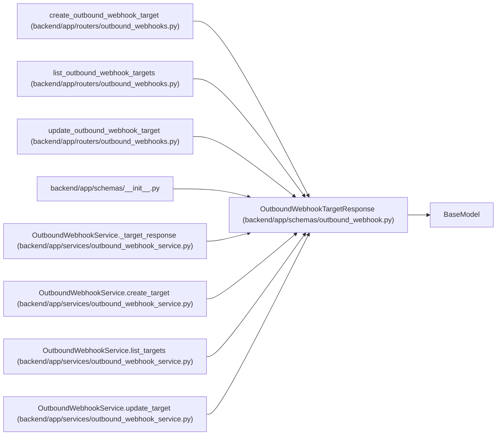

# OutboundWebhookTargetResponse

**Location:** `backend/app/schemas/outbound_webhook.py:134`
**Kind:** Pydantic model
**Bases:** `BaseModel`
**Module:** [schemas_outbound_webhook](../modules/schemas_outbound_webhook.md)

## Description

Outbound webhook target response without exposing the secret.

## Model Configuration

| Setting | Value | Source |
|---------|-------|--------|
| `from_attributes` | `True` | model_config |

## Attributes

| Name | Type | Wire name | Required | Nullable | Default | Constraints | Examples | Description |
|------|------|-----------|----------|----------|---------|-------------|-------------|----------|
| `id` | `int` | `id` | Yes | No | — | — | — | — |
| `name` | `str` | `name` | Yes | No | — | — | — | — |
| `description` | `Optional[str]` | `description` | No | Yes | `None` | — | — | — |
| `url` | `str` | `url` | Yes | No | — | — | — | — |
| `enabled` | `bool` | `enabled` | Yes | No | — | — | — | — |
| `subscribed_events_json` | `list[str]` | `subscribed_events_json` | Yes | No | — | — | — | — |
| `has_secret` | `bool` | `has_secret` | No | No | `False` | — | — | — |
| `headers_json` | `dict[str, str]` | `headers_json` | Yes | No | — | — | — | — |
| `created_at` | `datetime` | `created_at` | Yes | No | — | — | — | — |
| `updated_at` | `datetime` | `updated_at` | Yes | No | — | — | — | — |

## Methods

*No public methods. Inherits from base classes.*

## Relationships

<!-- Auto-generated relationship summary. Do not edit by hand. -->

### Summary

| Module | Methods | Attributes |
|---|---:|---|
| [schemas_outbound_webhook](../modules/schemas_outbound_webhook.md) | 0 | `created_at`, `description`, `enabled`, `has_secret`, `headers_json`, `id`, `name`, `subscribed_events_json`, `updated_at`, `url` |

### Structure

| Kind | Entity | Module |
|---|---|---|
| Base | `BaseModel` | — |

### References

| Reference | Kind | Source | Call sites |
|---|---|---|---:|
| `create_outbound_webhook_target` | type_reference | [outbound_webhooks](../modules/outbound_webhooks.md) | — |
| `list_outbound_webhook_targets` | type_reference | [outbound_webhooks](../modules/outbound_webhooks.md) | — |
| `update_outbound_webhook_target` | type_reference | [outbound_webhooks](../modules/outbound_webhooks.md) | — |
| `__init__` | import | [schemas___init__](../modules/schemas___init__.md) | — |
| `OutboundWebhookService._target_response` | call | [outbound_webhook_service](../modules/outbound_webhook_service.md) | 1 |
| `OutboundWebhookService._target_response` | type_reference | [outbound_webhook_service](../modules/outbound_webhook_service.md) | — |
| `OutboundWebhookService.create_target` | type_reference | [outbound_webhook_service](../modules/outbound_webhook_service.md) | — |
| `OutboundWebhookService.list_targets` | type_reference | [outbound_webhook_service](../modules/outbound_webhook_service.md) | — |
| `OutboundWebhookService.update_target` | type_reference | [outbound_webhook_service](../modules/outbound_webhook_service.md) | — |
