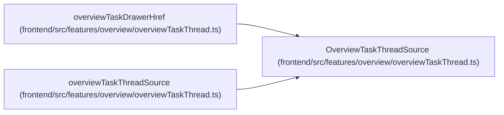

# OverviewTaskThreadSource

**Location:** `frontend/src/features/overview/overviewTaskThread.ts:8`
**Kind:** Type alias
**Bases:** —
**Module:** [overviewTaskThread](../modules/overviewTaskThread.md)

## Description

_Auto-generated from `OverviewTaskThreadSource` in `frontend/src/features/overview/overviewTaskThread.ts`._

## Attributes

*No annotated attributes found.*

## Methods

*No public methods. Inherits from base classes.*

## Relationships

<!-- Auto-generated relationship summary. Do not edit by hand. -->

### Summary

| Module | Methods | Attributes |
|---|---:|---|
| [overviewTaskThread](../modules/overviewTaskThread.md) | 0 | — |

### References

| Reference | Kind | Source | Call sites |
|---|---|---|---:|
| `overviewTaskDrawerHref` | type_reference | [overviewTaskThread](../modules/overviewTaskThread.md) | — |
| `overviewTaskThreadSource` | type_reference | [overviewTaskThread](../modules/overviewTaskThread.md) | — |
