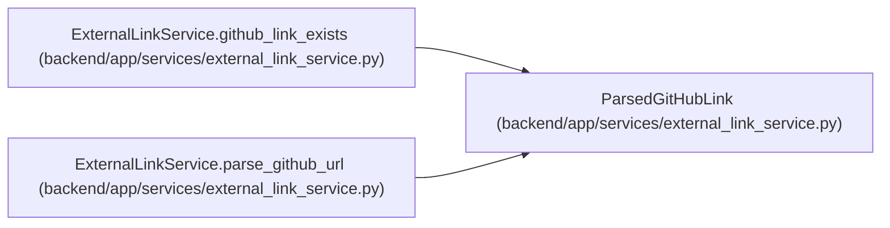

# ParsedGitHubLink

**Location:** `backend/app/services/external_link_service.py:32`
**Kind:** Class
**Bases:** —
**Module:** [external_link_service](../modules/external_link_service.md)

**Decorators:** `@dataclass(frozen=True)`

## Description

Normalized GitHub link details ready for persistence.

## Attributes

| Name | Type | Default | Description |
|------|------|---------|-------------|
| `github_type` | `str` | *required* | — |
| `owner` | `str` | *required* | — |
| `repo` | `str` | *required* | — |
| `repo_full_name` | `str` | *required* | — |
| `number` | `Optional[int]` | *required* | — |
| `branch` | `Optional[str]` | *required* | — |
| `external_key` | `str` | *required* | — |
| `url` | `str` | *required* | — |
| `title` | `str` | *required* | — |

## Methods

| Method | Signature | Decorators | Description |
|--------|-----------|------------|-------------|
| `metadata_json` | `() -> dict[str, Any]` | `@property` | Return the public metadata stored with the external link. |

## Relationships

<!-- Auto-generated relationship summary. Do not edit by hand. -->

### Summary

| Module | Methods | Attributes |
|---|---:|---|
| [external_link_service](../modules/external_link_service.md) | 1 | `branch`, `external_key`, `github_type`, `number`, `owner`, `repo`, `repo_full_name`, `title`, `url` |

### References

| Reference | Kind | Source | Call sites |
|---|---|---|---:|
| `ExternalLinkService.github_link_exists` | type_reference | [external_link_service](../modules/external_link_service.md) | — |
| `ExternalLinkService.parse_github_url` | call | [external_link_service](../modules/external_link_service.md) | 3 |
| `ExternalLinkService.parse_github_url` | type_reference | [external_link_service](../modules/external_link_service.md) | — |
