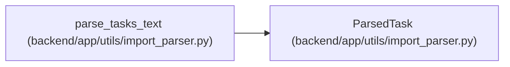

# ParsedTask

**Location:** `backend/app/utils/import_parser.py:9`
**Kind:** Class
**Bases:** —
**Module:** [import_parser](../modules/import_parser.md)

**Decorators:** `@dataclass`

## Description

Parsed task data from text import.

## Attributes

| Name | Type | Default | Description |
|------|------|---------|-------------|
| `title` | `str` | *required* | — |
| `description` | `Optional[str]` | `None` | — |
| `priority` | `Optional[int]` | `None` | — |
| `assignee_name` | `Optional[str]` | `None` | — |
| `effort_days` | `Optional[float]` | `None` | — |
| `id` | `Optional[int]` | `None` | — |

## Methods

*No public methods. Inherits from base classes.*

## Relationships

<!-- Auto-generated relationship summary. Do not edit by hand. -->

### Summary

| Module | Methods | Attributes |
|---|---:|---|
| [import_parser](../modules/import_parser.md) | 0 | `assignee_name`, `description`, `effort_days`, `id`, `priority`, `title` |

### References

| Reference | Kind | Source | Call sites |
|---|---|---|---:|
| `parse_tasks_text` | call | [import_parser](../modules/import_parser.md) | 3 |
| `parse_tasks_text` | type_reference | [import_parser](../modules/import_parser.md) | — |
