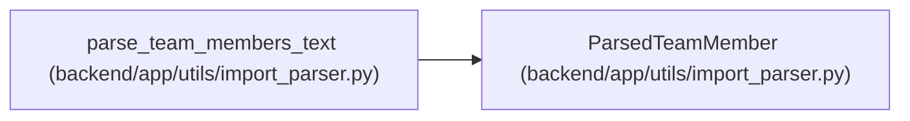

# ParsedTeamMember

**Location:** `backend/app/utils/import_parser.py:20`
**Kind:** Class
**Bases:** —
**Module:** [import_parser](../modules/import_parser.md)

**Decorators:** `@dataclass`

## Description

Parsed team member data from text import.

## Attributes

| Name | Type | Default | Description |
|------|------|---------|-------------|
| `name` | `str` | *required* | — |
| `position` | `str` | *required* | — |
| `availability_percent` | `float` | *required* | — |
| `professionalism_coefficient` | `float` | *required* | — |
| `operational_utilization` | `float` | *required* | — |

## Methods

*No public methods. Inherits from base classes.*

## Relationships

<!-- Auto-generated relationship summary. Do not edit by hand. -->

### Summary

| Module | Methods | Attributes |
|---|---:|---|
| [import_parser](../modules/import_parser.md) | 0 | `availability_percent`, `name`, `operational_utilization`, `position`, `professionalism_coefficient` |

### References

| Reference | Kind | Source | Call sites |
|---|---|---|---:|
| `parse_team_members_text` | call | [import_parser](../modules/import_parser.md) | 1 |
| `parse_team_members_text` | type_reference | [import_parser](../modules/import_parser.md) | — |
