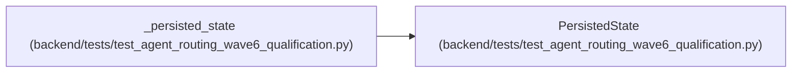

# PersistedState

**Location:** `backend/tests/test_agent_routing_wave6_qualification.py:100`
**Kind:** Class
**Bases:** —
**Module:** [test_agent_routing_wave6_qualification](../modules/test_agent_routing_wave6_qualification.md)

**Decorators:** `@dataclass(frozen=True)`

## Description

_Auto-generated from `PersistedState` in `backend/tests/test_agent_routing_wave6_qualification.py`._

## Attributes

| Name | Type | Default | Description |
|------|------|---------|-------------|
| `task` | `Task` | *required* | — |
| `assignments` | `list[AgentTaskAssignment]` | *required* | — |
| `runs` | `list[AgentRun]` | *required* | — |
| `events` | `list[TaskEvent]` | *required* | — |

## Methods

*No public methods. Inherits from base classes.*

## Relationships

<!-- Auto-generated relationship summary. Do not edit by hand. -->

### Summary

| Module | Methods | Attributes |
|---|---:|---|
| [test_agent_routing_wave6_qualification](../modules/test_agent_routing_wave6_qualification.md) | 0 | `assignments`, `events`, `runs`, `task` |

### References

| Reference | Kind | Source | Call sites |
|---|---|---|---:|
| `_persisted_state` | call | [test_agent_routing_wave6_qualification](../modules/test_agent_routing_wave6_qualification.md) | 1 |
| `_persisted_state` | type_reference | [test_agent_routing_wave6_qualification](../modules/test_agent_routing_wave6_qualification.md) | — |
