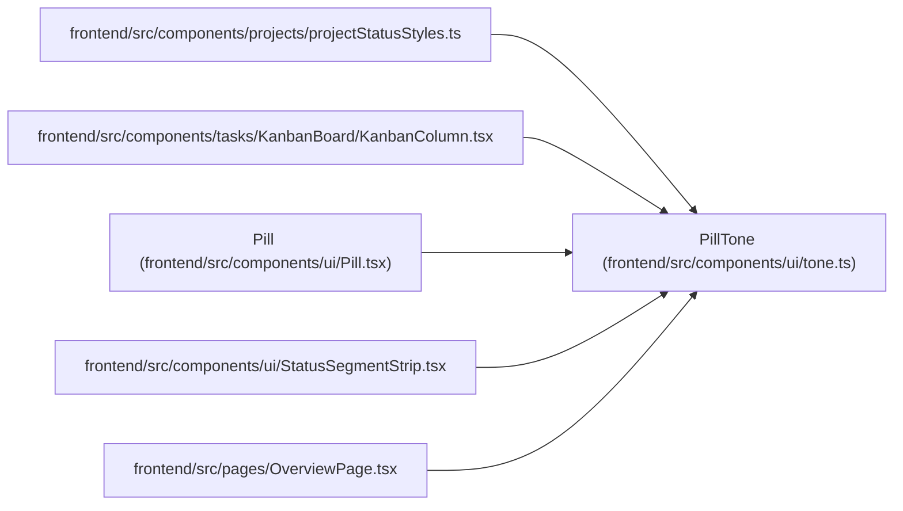

# PillTone

**Location:** `frontend/src/components/ui/tone.ts:3`
**Kind:** Type alias
**Bases:** —
**Module:** [tone](../modules/tone.md)

## Description

_Auto-generated from `PillTone` in `frontend/src/components/ui/tone.ts`._

## Attributes

*No annotated attributes found.*

## Methods

*No public methods. Inherits from base classes.*

## Relationships

<!-- Auto-generated relationship summary. Do not edit by hand. -->

### Summary

| Module | Methods | Attributes |
|---|---:|---|
| [tone](../modules/tone.md) | 0 | — |

### References

| Reference | Kind | Source | Call sites |
|---|---|---|---:|
| `projectStatusStyles` | import | [projectStatusStyles](../modules/projectStatusStyles.md) | — |
| `KanbanColumn` | import | [KanbanColumn](../modules/KanbanColumn.md) | — |
| `Pill` | type_reference | [Pill](../modules/Pill.md) | — |
| `StatusSegmentStrip` | import | [StatusSegmentStrip](../modules/StatusSegmentStrip.md) | — |
| `OverviewPage` | import | [OverviewPage](../modules/OverviewPage.md) | — |
