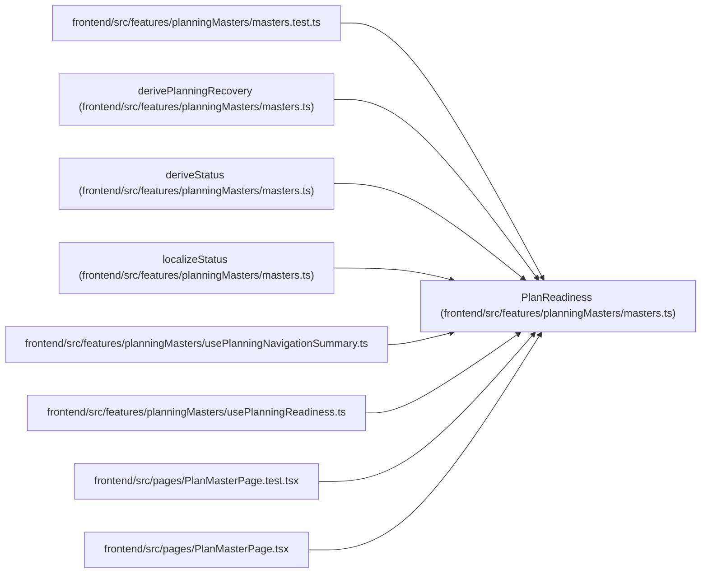

# PlanReadiness

**Location:** `frontend/src/features/planningMasters/masters.ts:93`
**Kind:** Class
**Bases:** —
**Module:** [planningMasters_masters](../modules/planningMasters_masters.md)

## Description

_Auto-generated from `PlanReadiness` in `frontend/src/features/planningMasters/masters.ts`._

## Attributes

| Name | Type | Default | Description |
|------|------|---------|-------------|
| `iterationCount` | `number` | *required* | — |
| `hasCurrentIteration` | `boolean` | *required* | — |
| `currentIterationName` | `string` | *required* | — |
| `currentIterationStart` | `string` | *required* | — |
| `currentIterationEnd` | `string` | *required* | — |
| `currentIterationDays` | `number` | *required* | — |
| `teamMemberCount` | `number` | *required* | — |
| `teamCapacity` | `number` | *required* | — |
| `teamMembersNoCap` | `number` | *required* | — |
| `taskCount` | `number` | *required* | — |
| `tasksWithoutAssignee` | `number` | *required* | — |
| `tasksWithoutEffort` | `number` | *required* | — |
| `hasGanttSchedule` | `boolean` | *required* | — |
| `ganttLastBuilt` | `string` | *required* | — |
| `riskCount` | `number` | *required* | — |
| `inboxCount` | `number` | *required* | — |

## Methods

*No public methods. Inherits from base classes.*

## Relationships

<!-- Auto-generated relationship summary. Do not edit by hand. -->

### Summary

| Module | Methods | Attributes |
|---|---:|---|
| [planningMasters_masters](../modules/planningMasters_masters.md) | 0 | `currentIterationDays`, `currentIterationEnd`, `currentIterationName`, `currentIterationStart`, `ganttLastBuilt`, `hasCurrentIteration`, `hasGanttSchedule`, `inboxCount`, `iterationCount`, `riskCount`, `taskCount`, `tasksWithoutAssignee` |

### References

| Reference | Kind | Source | Call sites |
|---|---|---|---:|
| `masters.test` | import | [planningMasters_masters.test](../modules/planningMasters_masters.test.md) | — |
| `derivePlanningRecovery` | type_reference | [planningMasters_masters](../modules/planningMasters_masters.md) | — |
| `deriveStatus` | type_reference | [planningMasters_masters](../modules/planningMasters_masters.md) | — |
| `localizeStatus` | type_reference | [planningMasters_masters](../modules/planningMasters_masters.md) | — |
| `usePlanningNavigationSummary` | import | [usePlanningNavigationSummary](../modules/usePlanningNavigationSummary.md) | — |
| `usePlanningReadiness` | import | [usePlanningReadiness](../modules/usePlanningReadiness.md) | — |
| `PlanMasterPage.test` | import | [PlanMasterPage.test](../modules/PlanMasterPage.test.md) | — |
| `PlanMasterPage` | import | [PlanMasterPage](../modules/PlanMasterPage.md) | — |
