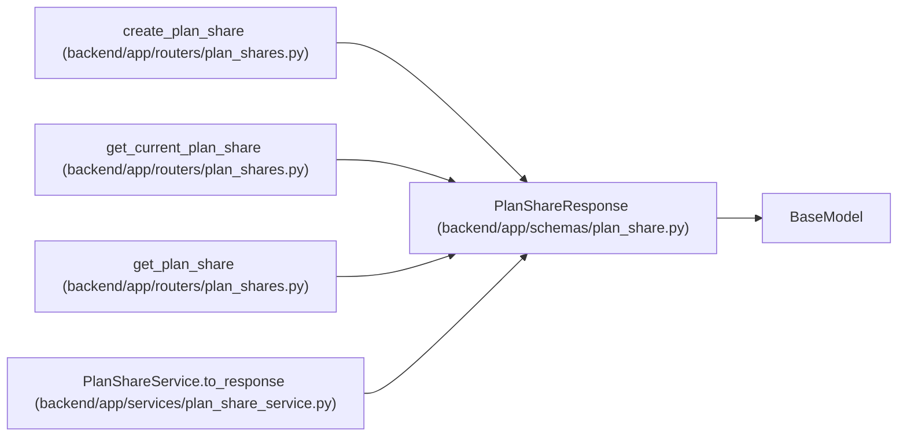

# PlanShareResponse

**Location:** `backend/app/schemas/plan_share.py:9`
**Kind:** Pydantic model
**Bases:** `BaseModel`
**Module:** [schemas_plan_share](../modules/schemas_plan_share.md)

## Description

A revocable plan snapshot link and its immutable captured data.

## Model Configuration

| Setting | Value | Source |
|---------|-------|--------|
| `from_attributes` | `True` | model_config |

## Attributes

| Name | Type | Wire name | Required | Nullable | Default | Constraints | Examples | Description |
|------|------|-----------|----------|----------|---------|-------------|-------------|----------|
| `id` | `int` | `id` | Yes | No | — | — | — | — |
| `public_id` | `str` | `public_id` | Yes | No | — | — | — | — |
| `iteration_id` | `int` | `iteration_id` | Yes | No | — | — | — | — |
| `iteration_name` | `str` | `iteration_name` | Yes | No | — | — | — | — |
| `created_by_display` | `str` | `created_by_display` | Yes | No | — | — | — | — |
| `snapshot_data` | `dict[str, Any]` | `snapshot_data` | No | No | factory: `dict` | — | — | — |
| `created_at` | `datetime` | `created_at` | Yes | No | — | — | — | — |
| `revoked_at` | `datetime \| None` | `revoked_at` | No | Yes | `None` | — | — | — |
| `expires_at` | `datetime \| None` | `expires_at` | No | Yes | `None` | — | — | — |

## Methods

*No public methods. Inherits from base classes.*

## Relationships

<!-- Auto-generated relationship summary. Do not edit by hand. -->

### Summary

| Module | Methods | Attributes |
|---|---:|---|
| [schemas_plan_share](../modules/schemas_plan_share.md) | 0 | `created_at`, `created_by_display`, `expires_at`, `id`, `iteration_id`, `iteration_name`, `public_id`, `revoked_at`, `snapshot_data` |

### Structure

| Kind | Entity | Module |
|---|---|---|
| Base | `BaseModel` | — |

### References

| Reference | Kind | Source | Call sites |
|---|---|---|---:|
| `create_plan_share` | type_reference | [plan_shares](../modules/plan_shares.md) | — |
| `get_current_plan_share` | type_reference | [plan_shares](../modules/plan_shares.md) | — |
| `get_plan_share` | type_reference | [plan_shares](../modules/plan_shares.md) | — |
| `PlanShareService.to_response` | call | [plan_share_service](../modules/plan_share_service.md) | 1 |
| `PlanShareService.to_response` | type_reference | [plan_share_service](../modules/plan_share_service.md) | — |
