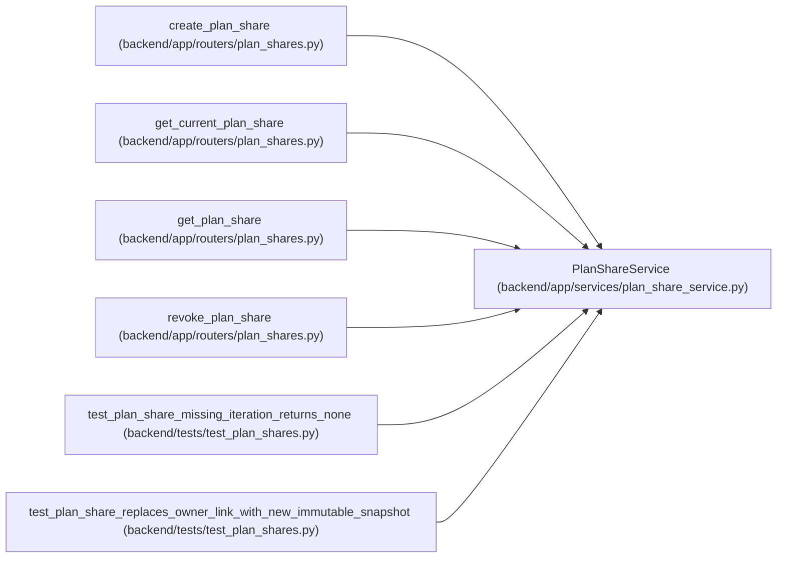

# PlanShareService

**Location:** `backend/app/services/plan_share_service.py:16`
**Kind:** Class
**Bases:** —
**Module:** [plan_share_service](../modules/plan_share_service.md)

## Description

Persist plan snapshots without exposing mutable planning records.

## Attributes

*No annotated attributes found.*

## Methods

| Method | Signature | Decorators | Description |
|--------|-----------|------------|-------------|
| `__init__` | `(db: AsyncSession)` | — | — |
| `_query` | `()` | `@staticmethod` | — |
| `to_response` | `(share: PlanShare) -> PlanShareResponse` | `@staticmethod` | — |
| `_share_snapshot` | `(snapshot_data: dict) -> dict` | `@staticmethod` | Keep token-scoped responses limited to plan-review information. |
| `get_owned_current` | *(async)* `(iteration_id: int, session_id: int) -> PlanShare \| None` | — | — |
| `get_active_by_public_id` | *(async)* `(public_id: str) -> PlanShare \| None` | — | — |
| `create` | *(async)* `(iteration_id: int, session: UserSession) -> PlanShare \| None` | — | — |
| `revoke` | *(async)* `(share_id: int, session_id: int) -> bool` | — | — |

## Relationships

<!-- Auto-generated relationship summary. Do not edit by hand. -->

### Summary

| Module | Methods | Attributes |
|---|---:|---|
| [plan_share_service](../modules/plan_share_service.md) | 8 | — |

### References

| Reference | Kind | Source | Call sites |
|---|---|---|---:|
| `create_plan_share` | call | [plan_shares](../modules/plan_shares.md) | 1 |
| `get_current_plan_share` | call | [plan_shares](../modules/plan_shares.md) | 1 |
| `get_plan_share` | call | [plan_shares](../modules/plan_shares.md) | 1 |
| `revoke_plan_share` | call | [plan_shares](../modules/plan_shares.md) | 1 |
| `test_plan_share_missing_iteration_returns_none` | call | [test_plan_shares](../modules/test_plan_shares.md) | 1 |
| `test_plan_share_replaces_owner_link_with_new_immutable_snapshot` | call | [test_plan_shares](../modules/test_plan_shares.md) | 1 |
