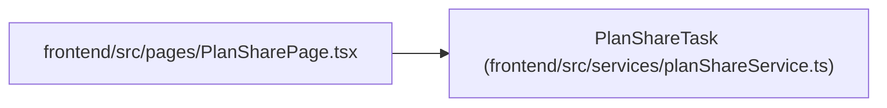

# PlanShareTask

**Location:** `frontend/src/services/planShareService.ts:3`
**Kind:** Class
**Bases:** —
**Module:** [planShareService](../modules/planShareService.md)

## Description

_Auto-generated from `PlanShareTask` in `frontend/src/services/planShareService.ts`._

## Attributes

| Name | Type | Default | Description |
|------|------|---------|-------------|
| `id` | `number` | *required* | — |
| `title` | `string` | *required* | — |
| `priority` | `number` | *required* | — |
| `effort_days` | `number` | *required* | — |
| `effort_hours` | `number` | *required* | — |
| `status` | `string` | *required* | — |
| `assignee_name` | `string \| null` | *required* | — |
| `start_date` | `string \| null` | *required* | — |
| `end_date` | `string \| null` | *required* | — |
| `is_optional` | `boolean` | *required* | — |
| `is_deferred` | `boolean` | *required* | — |
| `tags` | `string[]` | *required* | — |
| `dependencies` | `number[]` | *required* | — |
| `children` | `PlanShareTask[]` | *required* | — |

## Methods

*No public methods. Inherits from base classes.*

## Relationships

<!-- Auto-generated relationship summary. Do not edit by hand. -->

### Summary

| Module | Methods | Attributes |
|---|---:|---|
| [planShareService](../modules/planShareService.md) | 0 | `assignee_name`, `children`, `dependencies`, `effort_days`, `effort_hours`, `end_date`, `id`, `is_deferred`, `is_optional`, `priority`, `start_date`, `status` |

### References

| Reference | Kind | Source | Call sites |
|---|---|---|---:|
| `PlanSharePage` | import | [PlanSharePage](../modules/PlanSharePage.md) | — |
