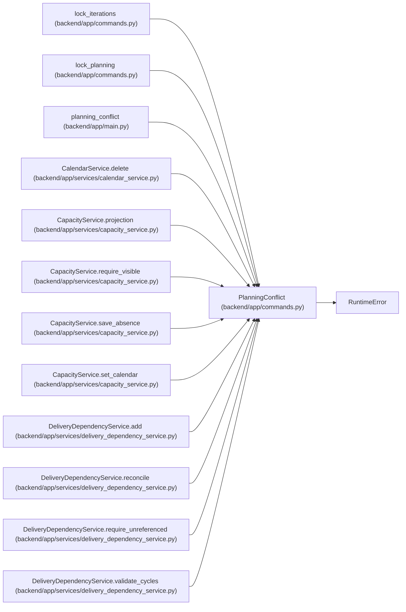

# PlanningConflict

**Location:** `backend/app/commands.py:41`
**Kind:** Class
**Bases:** `RuntimeError`
**Module:** [commands](../modules/commands.md)

## Description

_Auto-generated from `PlanningConflict` in `backend/app/commands.py`._

## Attributes

*No annotated attributes found.*

## Methods

| Method | Signature | Decorators | Description |
|--------|-----------|------------|-------------|
| `__init__` | `(code, message)` | — | — |
| `detail` | `()` | — | — |

## Relationships

<!-- Auto-generated relationship summary. Do not edit by hand. -->

### Summary

| Module | Methods | Attributes |
|---|---:|---|
| [commands](../modules/commands.md) | 2 | — |

### Structure

| Kind | Entity | Module |
|---|---|---|
| Base | `RuntimeError` | — |

### References

| Reference | Kind | Source | Call sites |
|---|---|---|---:|
| `lock_iterations` | call | [commands](../modules/commands.md) | 1 |
| `lock_planning` | call | [commands](../modules/commands.md) | 1 |
| `planning_conflict` | type_reference | [app_main](../modules/app_main.md) | — |
| `CalendarService.delete` | call | [calendar_service](../modules/calendar_service.md) | 1 |
| `CapacityService.projection` | call | [capacity_service](../modules/capacity_service.md) | 1 |
| `CapacityService.require_visible` | call | [capacity_service](../modules/capacity_service.md) | 1 |
| `CapacityService.save_absence` | call | [capacity_service](../modules/capacity_service.md) | 3 |
| `CapacityService.set_calendar` | call | [capacity_service](../modules/capacity_service.md) | 2 |
| `DeliveryDependencyService.add` | call | [delivery_dependency_service](../modules/delivery_dependency_service.md) | 1 |
| `DeliveryDependencyService.reconcile` | call | [delivery_dependency_service](../modules/delivery_dependency_service.md) | 1 |
| `DeliveryDependencyService.require_unreferenced` | call | [delivery_dependency_service](../modules/delivery_dependency_service.md) | 1 |
| `DeliveryDependencyService.validate_cycles` | call | [delivery_dependency_service](../modules/delivery_dependency_service.md) | 1 |

> References: showing 12 of 23 logical references; 11 omitted by the 12-row generated summary limit.
