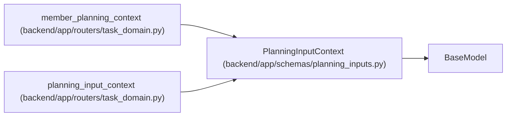

# PlanningInputContext

**Location:** `backend/app/schemas/planning_inputs.py:23`
**Kind:** Pydantic model
**Bases:** `BaseModel`
**Module:** [planning_inputs](../modules/planning_inputs.md)

## Description

_Auto-generated from `PlanningInputContext` in `backend/app/schemas/planning_inputs.py`._

## Attributes

| Name | Type | Wire name | Required | Nullable | Default | Constraints | Examples | Description |
|------|------|-----------|----------|----------|---------|-------------|-------------|----------|
| `kind` | `Literal['calendar', 'project', 'iteration', 'profile', 'member', 'vacation']` | `kind` | Yes | No | — | — | — | — |
| `resource_id` | `PositiveInt` | `resource_id` | Yes | No | — | — | — | — |
| `resource` | `dict[str, Any]` | `resource` | Yes | No | — | — | — | — |
| `expected_revisions` | `dict[PositiveInt, PositiveInt]` | `expected_revisions` | Yes | No | — | max_length=500 | — | — |
| `complete` | `Literal[True]` | `complete` | No | No | `True` | — | — | — |

## Methods

*No public methods. Inherits from base classes.*

## Relationships

<!-- Auto-generated relationship summary. Do not edit by hand. -->

### Summary

| Module | Methods | Attributes |
|---|---:|---|
| [planning_inputs](../modules/planning_inputs.md) | 0 | `complete`, `expected_revisions`, `kind`, `resource`, `resource_id` |

### Structure

| Kind | Entity | Module |
|---|---|---|
| Base | `BaseModel` | — |

### References

| Reference | Kind | Source | Call sites |
|---|---|---|---:|
| `member_planning_context` | type_reference | [routers_task_domain](../modules/routers_task_domain.md) | — |
| `planning_input_context` | type_reference | [routers_task_domain](../modules/routers_task_domain.md) | — |
