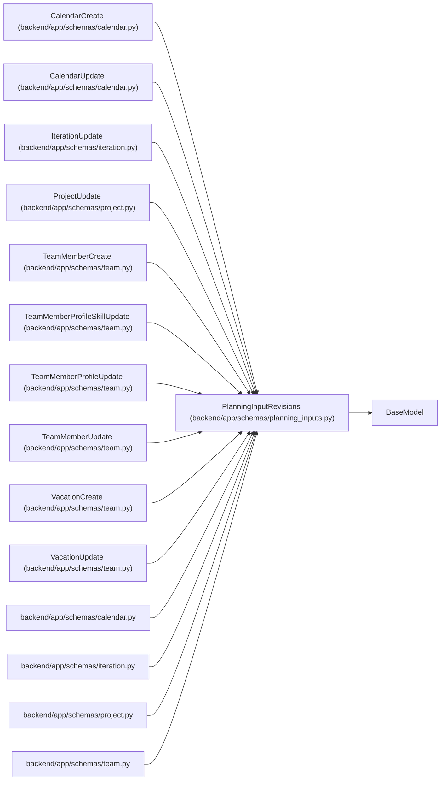

# PlanningInputRevisions

**Location:** `backend/app/schemas/planning_inputs.py:19`
**Kind:** Pydantic model
**Bases:** `BaseModel`
**Module:** [planning_inputs](../modules/planning_inputs.md)

## Description

_Auto-generated from `PlanningInputRevisions` in `backend/app/schemas/planning_inputs.py`._

## Attributes

| Name | Type | Wire name | Required | Nullable | Default | Constraints | Examples | Description |
|------|------|-----------|----------|----------|---------|-------------|-------------|----------|
| `expected_revisions` | `dict[int, PositiveInt]` | `expected_revisions` | No | No | factory: `dict` | — | — | — |

## Methods

*No public methods. Inherits from base classes.*

## Relationships

<!-- Auto-generated relationship summary. Do not edit by hand. -->

### Summary

| Module | Methods | Attributes |
|---|---:|---|
| [planning_inputs](../modules/planning_inputs.md) | 0 | `expected_revisions` |

### Structure

| Kind | Entity | Module |
|---|---|---|
| Base | `BaseModel` | — |
| Subclass | `CalendarCreate` | [schemas_calendar](../modules/schemas_calendar.md) |
| Subclass | `CalendarUpdate` | [schemas_calendar](../modules/schemas_calendar.md) |
| Subclass | `IterationUpdate` | [schemas_iteration](../modules/schemas_iteration.md) |
| Subclass | `ProjectUpdate` | [schemas_project](../modules/schemas_project.md) |
| Subclass | `TeamMemberCreate` | [schemas_team](../modules/schemas_team.md) |
| Subclass | `TeamMemberProfileSkillUpdate` | [schemas_team](../modules/schemas_team.md) |
| Subclass | `TeamMemberProfileUpdate` | [schemas_team](../modules/schemas_team.md) |
| Subclass | `TeamMemberUpdate` | [schemas_team](../modules/schemas_team.md) |
| Subclass | `VacationCreate` | [schemas_team](../modules/schemas_team.md) |
| Subclass | `VacationUpdate` | [schemas_team](../modules/schemas_team.md) |

### References

| Reference | Kind | Source | Call sites |
|---|---|---|---:|
| `calendar` | import | [schemas_calendar](../modules/schemas_calendar.md) | — |
| `iteration` | import | [schemas_iteration](../modules/schemas_iteration.md) | — |
| `project` | import | [schemas_project](../modules/schemas_project.md) | — |
| `team` | import | [schemas_team](../modules/schemas_team.md) | — |
