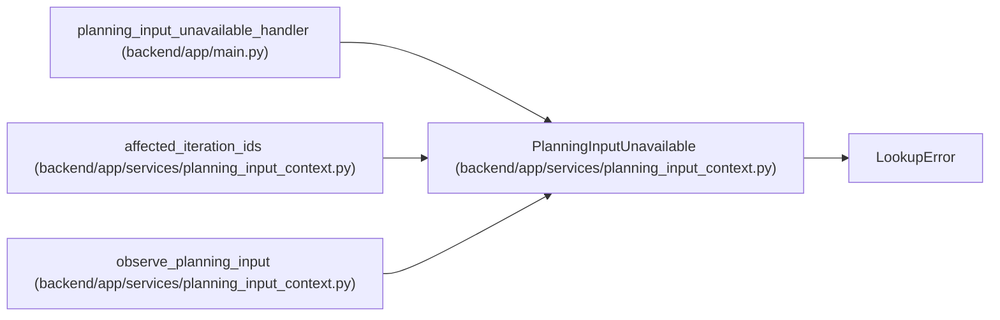

# PlanningInputUnavailable

**Location:** `backend/app/services/planning_input_context.py:10`
**Kind:** Class
**Bases:** `LookupError`
**Module:** [planning_input_context](../modules/planning_input_context.md)

## Description

A shared planning input is absent or outside the authorized graph.

## Attributes

*No annotated attributes found.*

## Methods

*No public methods. Inherits from base classes.*

## Relationships

<!-- Auto-generated relationship summary. Do not edit by hand. -->

### Summary

| Module | Methods | Attributes |
|---|---:|---|
| [planning_input_context](../modules/planning_input_context.md) | 0 | — |

### Structure

| Kind | Entity | Module |
|---|---|---|
| Base | `LookupError` | — |

### References

| Reference | Kind | Source | Call sites |
|---|---|---|---:|
| `planning_input_unavailable_handler` | type_reference | [app_main](../modules/app_main.md) | — |
| `affected_iteration_ids` | call | [planning_input_context](../modules/planning_input_context.md) | 1 |
| `observe_planning_input` | call | [planning_input_context](../modules/planning_input_context.md) | 1 |
