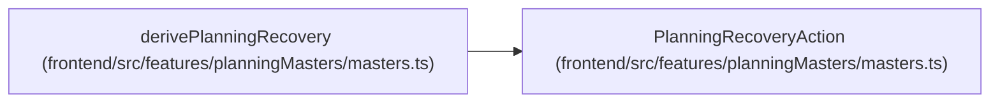

# PlanningRecoveryAction

**Location:** `frontend/src/features/planningMasters/masters.ts:122`
**Kind:** Class
**Bases:** —
**Module:** [planningMasters_masters](../modules/planningMasters_masters.md)

## Description

_Auto-generated from `PlanningRecoveryAction` in `frontend/src/features/planningMasters/masters.ts`._

## Attributes

| Name | Type | Required | Default | Description |
|------|------|----------|---------|-------------|
| `kind` | `PlanningRecoveryKind` | Yes | — | — |
| `ownerStep` | `PlanningStepId` | Yes | — | — |
| `route` | `string` | Yes | — | — |
| `count` | `number` | No | — | — |
| `planningIssue` | `PlanningTaskIssue` | No | — | — |
| `query` | `Record<string, string>` | No | — | — |

## Methods

*No public methods. Inherits from base classes.*

## Relationships

<!-- Auto-generated relationship summary. Do not edit by hand. -->

### Summary

| Module | Methods | Attributes |
|---|---:|---|
| [planningMasters_masters](../modules/planningMasters_masters.md) | 0 | `count`, `kind`, `ownerStep`, `planningIssue`, `query`, `route` |

### References

| Reference | Kind | Source | Call sites |
|---|---|---|---:|
| `derivePlanningRecovery` | type_reference | [planningMasters_masters](../modules/planningMasters_masters.md) | — |
