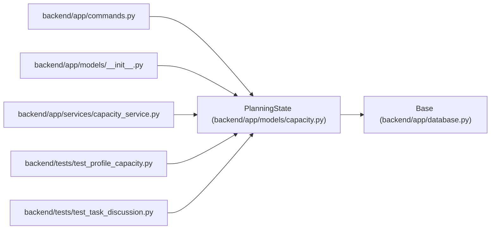

# PlanningState

**Location:** `backend/app/models/capacity.py:11`
**Kind:** Class
**Bases:** `Base`
**Module:** [models_capacity](../modules/models_capacity.md)

## Description

Lazy singleton used to serialize shared planning before iteration and task reservations. Each command reserves one revision; preview and failure roll back that reservation with domain changes. This is a coarse workspace serialization boundary, not a global scheduling optimizer.

## Attributes

| Name | Type | Default | Description |
|------|------|---------|-------------|
| `id` | `Mapped[int]` | `mapped_column(Integer, primary_key=True)` | — |
| `revision` | `Mapped[int]` | `mapped_column(Integer, nullable=False, default=0)` | — |

## Methods

*No public methods. Inherits from base classes.*

## Relationships

<!-- Auto-generated relationship summary. Do not edit by hand. -->

### Summary

| Module | Methods | Attributes |
|---|---:|---|
| [models_capacity](../modules/models_capacity.md) | 0 | `id`, `revision` |

### Structure

| Kind | Entity | Module |
|---|---|---|
| Base | `Base` | [app_database](../modules/app_database.md) |

### References

| Reference | Kind | Source | Call sites |
|---|---|---|---:|
| `commands` | import | [commands](../modules/commands.md) | — |
| `__init__` | import | [models___init__](../modules/models___init__.md) | — |
| `capacity_service` | import | [capacity_service](../modules/capacity_service.md) | — |
| `test_profile_capacity` | import | [test_profile_capacity](../modules/test_profile_capacity.md) | — |
| `test_task_discussion` | import | [test_task_discussion](../modules/test_task_discussion.md) | — |
