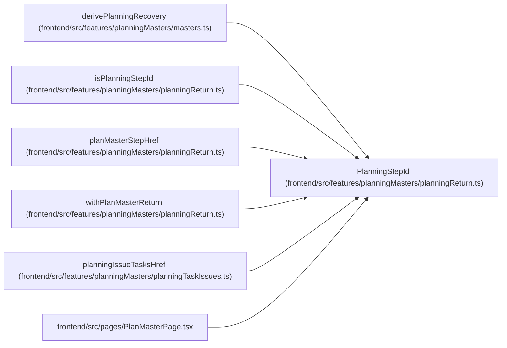

# PlanningStepId

**Location:** `frontend/src/features/planningMasters/planningReturn.ts:12`
**Kind:** Type alias
**Bases:** —
**Module:** [planningReturn](../modules/planningReturn.md)

## Description

_Auto-generated from `PlanningStepId` in `frontend/src/features/planningMasters/planningReturn.ts`._

## Attributes

*No annotated attributes found.*

## Methods

*No public methods. Inherits from base classes.*

## Relationships

<!-- Auto-generated relationship summary. Do not edit by hand. -->

### Summary

| Module | Methods | Attributes |
|---|---:|---|
| [planningReturn](../modules/planningReturn.md) | 0 | — |

### References

| Reference | Kind | Source | Call sites |
|---|---|---|---:|
| `derivePlanningRecovery` | type_reference | [planningMasters_masters](../modules/planningMasters_masters.md) | — |
| `isPlanningStepId` | type_reference | [planningReturn](../modules/planningReturn.md) | — |
| `planMasterStepHref` | type_reference | [planningReturn](../modules/planningReturn.md) | — |
| `withPlanMasterReturn` | type_reference | [planningReturn](../modules/planningReturn.md) | — |
| `planningIssueTasksHref` | type_reference | [planningTaskIssues](../modules/planningTaskIssues.md) | — |
| `PlanMasterPage` | import | [PlanMasterPage](../modules/PlanMasterPage.md) | — |
