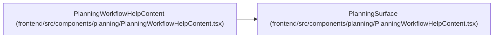

# PlanningSurface

**Location:** `frontend/src/components/planning/PlanningWorkflowHelpContent.tsx:15`
**Kind:** Type alias
**Bases:** —
**Module:** [PlanningWorkflowHelpContent](../modules/PlanningWorkflowHelpContent.md)
**Target:**

```typescript
'plan' | 'gantt'
```

## Description

_Auto-generated from `PlanningSurface` in `frontend/src/components/planning/PlanningWorkflowHelpContent.tsx`._

## Attributes

*See the alias definition for its member types.*

## Methods

*See the alias definition for callable and member types.*

## Relationships

<!-- Auto-generated relationship summary. Do not edit by hand. -->

```mermaid
flowchart LR
    n0["PlanningSurface (frontend/src/components/planning/PlanningWorkflowHelpContent.tsx)"]
    n1["PlanningWorkflowHelpContent (frontend/src/components/planning/PlanningWorkflowHelpContent.tsx)"]
    n1 --> n0
    click n0 "../modules/PlanningWorkflowHelpContent.md"
    click n1 "../modules/PlanningWorkflowHelpContent.md"
```

### Summary

| Module | Methods | Attributes |
|---|---:|---|
| [PlanningWorkflowHelpContent](../modules/PlanningWorkflowHelpContent.md) | 0 | — |

### References

| Reference | Kind | Source | Call sites |
|---|---|---|---:|
| `PlanningWorkflowHelpContent` | type_reference | [PlanningWorkflowHelpContent](../modules/PlanningWorkflowHelpContent.md) | — |
